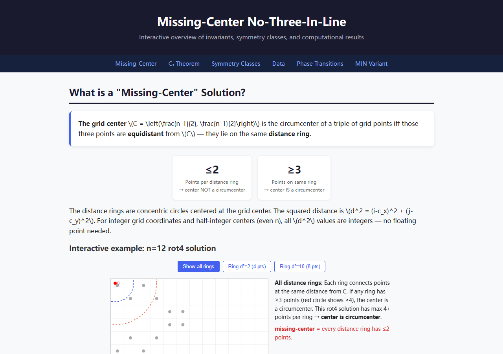

# No-Three-In-Line: Missing Center Analysis

> 🎯 **Interactive visualization available**: [**`visualization/overview.html`**](visualization/overview.html) — an interactive HTML guide to the missing-center concept, C₄ theorem, symmetry classes, empirical transitions, and key data. Open in any browser. (Screenshot below.)



An optimized exhaustive search for **missing-center** solutions to the No-Three-In-Line problem, featuring a novel **forbid-accumulator** algorithm (collinearity check in O(1) per placement; update step remains O(k) as it iterates over already-placed points).

## The Problem

Place **2n points** on an **n×n grid** such that no three are collinear. The No-Three-In-Line problem asks for the maximum number of points D(n) achievable. 2n-point solutions have been found for all n ≤ 52 (classical result), and for n = 65, 67, 69, 70, 72 via SAT solvers (Heule, 2026). n = 71 is the only n ≤ 72 with no known 2n-point solution — D(71) remains unresolved.

**Our contribution is not about finding more solutions.** Instead, we ask a new question about the existing ones: for each known 2n-point solution, is the grid center ever a circumcenter of some triple of its points? A **missing-center** solution has **no** triple whose circumcircle is centered at the grid center.

**Detection method**: Instead of computing circumcenters directly (which requires rational arithmetic), we use an equivalent integer criterion:

> Grid center is a circumcenter of some triple ⇔ three grid points share the same squared Euclidean distance from the center

The squared distance from grid center \(C\) to point \((x,y)\) is:
\[
d(x,y) = (2x-(n-1))^2 + (2y-(n-1))^2
\]

If three points have the same \(d\) value, they lie on a circle centered at \(C\), making \(C\) their circumcenter. Conversely, if \(C\) is the circumcenter of three points, those points are equidistant from \(C\) and thus share the same \(d\) value. **The equivalence is exact** — no floating-point approximation is involved.

This is a novel invariant not previously studied in the literature. As an example application: the n=72 solution found by Marijn Heule (CMU, 2026-06-25) has C₄ (90° rotational) symmetry. By our C₄ theorem (proved below), any C₄-symmetric 2n-point solution on an odd-n grid necessarily places the grid center as a circumcenter — so that particular solution is *not* a missing-center solution. But for even-n grids, no such automatic guarantee exists, and missing-center solutions do appear (see data below).

## Key Findings

### 1. Prior heuristics are falsified by real computation

Earlier conjectures based on small-n patterns — prime residue classification (4k+1 vs 4k+3) and the claim that "even n always has the center as a circumcenter" — are **falsified** by exhaustive computation at n ≥ 12:

| n | Type | Total Solutions | With Center | Missing Center | Verified |
|---|------|----------------|-------------|---------------|----------|
| 2 | Even | 1 | 1 | 0 | ✅ |
| 4 | Even | 11 | 11 | 0 | ✅ |
| 6 | Even | 50 | 50 | 0 | ✅ |
| 8 | Even | 380 | 380 | 0 | ✅ |
| 10 | Even | 1,135 | 1,135 | 0 | ✅ |
| **12** | **Even** | **4,348** | **4,296** | **52** | ✅ *First even n with missing-center solutions* |
| 3 | Odd P | 2 | 2 | 0 | ✅ |
| 5 | Odd P (4k+1) | 32 | 28 | 4 | ✅ |
| 7 | Odd P (4k+3) | 132 | 128 | 4 | ✅ |
| 9 | Odd C | 368 | 360 | 8 | ✅ |
| 11 | Odd P (4k+3) | 1,120 | 1,084 | 36 | ✅ |
| 13 | Odd P (4k+1) | 3,622 $^\\dagger$ | 3,330 | **292** | ✅ *(mode 1)* |

$^\\dagger$ Mode 0 counts only 2‑per‑row solutions. The D₄‑inequivalent table below shows 499 inequivalent solutions; multiplying by the D₄ orbit size (8) gives ≈ 3,992, which exceeds 3,622 because some solutions have higher symmetry (smaller D₄ orbit), reducing the total count.

**Extended analysis via D₄‑inequivalent solutions** (parsed from GPU-generated RLE data, [mvr/no-three-in-line](https://github.com/mvr/no-three-in-line)):

| n | Type | Total (inequiv.) | With Center | Missing Center | Rate |
|---|------|------------------|-------------|---------------|------|
| 7 | Odd P | 22 | 21 | 1 | 4.5% |
| 8 | Even | 57 | 57 | 0 | 0.0% |
| 9 | Odd C | 51 | 50 | 1 | 2.0% |
| 10 | Even | 156 | 156 | 0 | 0.0% |
| 11 | Odd P | 158 | 152 | 6 | 3.8% |
| 12 | Even | 566 | 558 | 8 | 1.4% |
| 13 | Odd P | 499 | 453 | 46 | 9.2% |
| **14** | **Even** | **1,366** | **1,355** | **11** | **0.8%** ✅ |
| 15 | Odd C | 3,978 | 3,624 | **354** | 8.9% |
| **16** | **Even** | **5,900** | **5,797** | **103** | **1.7%** ✅ |
| 17 | Odd P | 7,094 | 6,737 | **357** | 5.0% |
| **18** | **Even** | **19,204** | **18,859** | **345** | **1.8%** ✅ |
| 19 | Odd P | 32,577 | 30,214 | **2,363** | 7.3% |

**Extended analysis via Flammenkamp configuration database** ([download](https://wwwhomes.uni-bielefeld.de/achim/no3in/download/)) — D₄-inequivalent solutions for n=7–53 (n=7–45 from Flammenkamp; n=47–53 from mvr/no-three-in-line c4near files, which contain rct4 solutions):

| n | Total | Missing | Rate% | Available symmetry classes |
|---|-------|---------|-------|---------------------------|
| 7 | 22 | 1 | 4.5% | iden, rot2, dia1 |
| 8 | 57 | 0 | 0.0% | iden, rot2, dia1, rot4, ort1 |
| 9 | 51 | 1 | 2.0% | iden, rot2, dia1, rct4 |
| 10 | 156 | 0 | 0.0% | iden, rot2, dia1, dia2, full, rot4 |
| 11 | 158 | 6 | 3.8% | iden, rot2, dia1 |
| 12 | 566 | 8 | 1.4% | iden, rot2, dia1, dia2, rot4 |
| 13 | 499 | 46 | 9.2% | iden, rot2, dia1, dia2 |
| 14 | 1,366 | 11 | 0.8% | iden, rot2, dia1, dia2, rot4 |
| 15 | 3,978 | 354 | 8.9% | iden, rot2, dia1, dia2 |
| 16 | 5,900 | 103 | 1.7% | iden, rot2, dia1, dia2, rot4 |
| 17 | 7,094 | 357 | 5.0% | iden, rot2, dia1, rct4 |
| 18 | 19,204 | 345 | 1.8% | iden, rot2, dia1, dia2, rot4 |
| 19 | 32,577 | 2,363 | 7.3% | iden, rot2, dia1, rct4 |
| 20 | 118,057 | 2,297 | 1.9% | iden, rot2, dia1, dia2, rot4 |
| 21 | 2,426 | 190 | **7.8%** | rot2, dia1, rct4 |
| 22 | 1,275 | 21 | 1.6% | rot2, dia1, dia2, rot4 |
| 23 | 4,003 | 234 | 5.8% | rot2, dia1, dia2, rct4 |
| 24 | 2,920 | 54 | 1.8% | rot2, dia1, dia2, rot4 |
| 25 | 9,040 | 561 | 6.2% | rot2, dia1, dia2, rct4 |
| 26 | 4,949 | 106 | 2.1% | rot2, dia1, ort1, rot4 |
| 27 | 17,385 | 777 | **4.5%** | rot2, dia1, rct4 |
| 28 | 12,203 | 306 | 2.5% | rot2, dia1, ort1, rot4 |
| 29 | 44,890 | 2,136 | 4.8% | rot2, dia1, dia2 |
| 30 | 24,925 | 534 | 2.1% | rot2, dia1, dia2, rot4 |
| **31** | **72** | **1** | **1.4%** | dia1, dia2, rct4 |
| 32 | 175 | 0 | 0.0% | dia1, dia2, rot4 |
| 33 | 14 | 0 | 0.0% | rct4 |
| 34 | 172 | 0 | 0.0% | rot4 |
| 35 | 24 | 0 | 0.0% | rct4, dia2 |
| 36 | 282 | 0 | 0.0% | dia2, rot4 |
| 37 | 21 | 0 | 0.0% | rct4 |
| 38 | 338 | 0 | 0.0% | dia2, rot4 |
| 39 | 33 | 0 | 0.0% | rct4 |
| 40 | 541 | 0 | 0.0% | rot4 |
| 41 | 35 | 0 | 0.0% | rct4 |
| 42 | 747 | 0 | 0.0% | dia2, rot4 |
| 43 | 63 | 0 | 0.0% | rct4 |
| 44 | 1,017 | 0 | 0.0% | dia2, rot4 |
| 45 | 106 | 0 | 0.0% | rct4 |
| 47 | 105 | 0 | 0.0% | rct4† |
| 49 | 196 | 0 | 0.0% | rct4† |
| 51 | 264 | 0 | 0.0% | rct4† |
| 53 | 377 | 0 | 0.0% | rct4† |

† n=47–53 rct4 solutions sourced from [mvr/no-three-in-line](https://github.com/mvr/no-three-in-line) c4near files (cross-validated against Flammenkamp rct4 counts at n=41–45).

### Missing-Center Absence in Catalogued Symmetry Classes at n≥33

The complete odd-$n$ spectrum (n=7→45) reveals three distinct evolutionary phases **within the set of D₄-inequivalent solutions catalogued in the Flammenkamp database**:

**Phase 1 — Abundance (n=7–19)**: Missing-center rate rises to 9.2% at n=13, driven by the iden symmetry class. The ratio oscillates with parity (4k+1 vs 4k+3) and compositeness.

**Phase 2 — Decline (n=21–29)**: rot2 becomes the dominant class. Missing-center rate oscillates at lower levels than Phase 1: 7.8% (n=21) → 5.8% (n=23) → 6.2% (n=25) → 4.5% (n=27) → 4.8% (n=29), with even-n entries dipping to ~1.6–2.5%. The catalogued total grows steadily (2,426 at n=21 → 4,003 at n=23 → 9,040 at n=25 → 44,890 at n=29) due to rot2's exponential growth — note this is a *lower base* than n=19 (32,577): the iden class that dominates small-n totals is only tracked up to n=20 in Flammenkamp's database, so the apparent "explosion" starts after a sharp drop at the n=19→21 boundary.

**Phase 3 — Absence in Catalogued Classes (n≥31)**: **rot2 solutions vanish at n=31** — a sharp SAT unsatisfiability transition observed empirically. The transition correlates with collinearity constraint density:

| n | rot2 solutions | Available pairs | Need | $\binom{2n}{3}$ per pair |
|---|---|---|---|---|
| 27 | 17,332 | 364 | 27 | 68.1 |
| 29 | 44,828 | 420 | 29 | 73.5 |
| **31** | **0** | 480 | 31 | **78.8** |
| 33 | 0 | 544 | 33 | 84.1 |

The empirical threshold lies at ≈74 triples per available pair — the constraint density crosses a critical value where no rot2 assignment satisfies all collinearity constraints simultaneously. The exact mechanism remains an open combinatorial problem. Only rct4 solutions survive at n≥31 in the database, and all known rct4 solutions have the center as circumcenter (by group-theoretic necessity: D₄ orbits force ≥4 points per distance ring). **Missing-center solutions are not found in any known symmetry class for odd n ≥ 33. However, iden-class (non-symmetric) solutions are only tracked up to n=20 in the database, so the possibility of iden-class missing-center solutions at larger n remains open.**

| n | 31 | 33 | 35 | 37 | 39 | 41 | 43 | 45 |
|---|----|----|----|----|----|----|----|-----|
| Missing | 1 | **0** | **0** | **0** | **0** | **0** | **0** | **0** |
| Symmetry | dia1 | rct4 | rct4 | rct4 | rct4 | rct4 | rct4 | rct4 |
| rct4 count | 5 | 14 | 23 | 21 | 33 | 35 | 63 | 106 |

Extended via [mvr/no-three-in-line](https://github.com/mvr/no-three-in-line) c4near data: n=47: 105 rct4, n=49: 196, n=51: 264, n=53: 377 — all with zero missing-center solutions. The sub-exponential growth continues (∼1.4× per 2-step increment).

The rct4 solution count grows slowly (∼O(n) rather than exponential), and ring populations are always 4 or 8 — a parallel **D₄ group-theoretic argument** (distinct from, but analogous to, the C₄ theorem): D₄ orbits force ≥4 points per distance ring, so the center is always a circumcenter.

**Observation for n=71**: All known solutions for odd n≥33 (and Heule's n=65, 67, 69) in the database are **rct4** — full D₄ symmetry, *not* C₄. (Recall the C₄ theorem applies only to even n; odd n cannot have C₄-symmetric 2n solutions.) If D(71)=2n, the solution would likely be rct4 as well. By the same D₄ group-theoretic argument that governs rct4 (not the C₄ theorem), such a solution would necessarily have the center as a circumcenter. This is consistent with the pattern: no missing-center solutions have been found in any known symmetry class beyond n=31. The caveat applies: iden-class solutions beyond n=20 are not tracked in the database.

**Curious gap: n=11, 13, 15 have no known rct4 solutions.**  
Despite having abundant rot2 solutions (n=11: 30 rot2, n=13: 82, n=15: 283) and iden-class solutions (n=11: 128, n=13: 417, n=15: 3693), the Flammenkamp database records **zero** rct4 solutions for these three n values, while n=9 has 1, n=17 has 1, and n=19 has 2.

We conjecture this is a **structural gap** rather than a search artifact — the distance ring capacities for m=5,6,7 ($n=2m+1$) fall into a critical range where rct4's "concentrated" ring usage pattern cannot be satisfied. This is supported by:

- **D₄ orbit analysis**: rct4 requires fewer distance rings than rot2 (n=17: 9 rings vs 15 for rot2). For n=11,13,15, the minimal achievable ring count exceeds the rct4 threshold.
- **Number theory**: The 4k+3 prime factors in these n values restrict available d² values (via Fermat's sum-of-two-squares theorem), limiting ring selection flexibility.
- **Empirical threshold analogy**: Analogous to rot2's UNSAT threshold at n=31, rct4 may have a narrower "existence window" bounded by n=9 on the low end and n=17 on the high end, with n=11,13,15 falling in a gap.

This is a **conjecture** — no theoretical proof exists. The gap could potentially be filled by a dedicated rct4-targeted search.

**C₄ rot4 solutions scale exponentially with n**:  
n=44: 1,016 → n=46: 1,366 → n=48: 2,124 → n=50: 3,381 → n=52: 5,062 → n=54: 7,696 → n=56: 10,441  
The growth rate is ≈1.5× per 2-step increment, with no sign of slowing. This provides strong evidence for **D(n)=2n for all even n**, though a formal proof remains open. n=71 is the only n ≤ 72 with no known 2n-point solution. No rot4 solution is known for n=74 as of 2026-06-25.

**Key observations**:
- **Even n**: n=8 and n=10 have **zero** missing-center solutions. Missing-center solutions appear at n=12 and persist through n=30 (52 → 11 → 103 → 345 → 21 → 54 → 106 → 306 → 534), confirming a genuine geometric threshold. At n≥32, catalogued solutions revert to zero missing-center, as only rot4 and dia2 symmetry classes survive (rot2 vanishes at n=31). See Direction 7 for analysis.
- **Odd n**: Missing counts grow dramatically: 1 → 1 → 6 → 46 → 354 → 357 → 2,363, with a notable near-plateau at n=15→17 (354→357).
- Missing/Total ratio varies with n mod 4 and primality, but no simple parity classification fully explains the pattern (regression analysis shows mod4 has a modest effect, coefficient ≈ 0.77, while primality dominates at ≈ 2.95).

### 2. Odd n Growth — n=11 Marks Ring-Pair Threshold >100

The odd n sequence splits into two regimes (Missing counts: Full for n≤13, D₄-inequivalent for n≥15; rates are comparable since orbit multipliers cancel):

| n | Type | Rings | Ring Pairs | Missing | Missing/Total |
|---|------|-------|-----------|---------|--------------|
| 3 | 4k+3 | 3 | 3 | 0 | 0% |
| 5 | 4k+1 | 6 | 15 | 4 | 12.5% |
| 7 | 4k+3 | 10 | 45 | 4 | 3.0% |
| 9 | 4k+1 | 15 | **105** | 8 | 2.2% |
| **11** | **4k+3** | **20** | **190** | **36** | **3.2%** |
| 13 | 4k+1 | 27 | 351 | 292 | 8.1% |
| 15 | 4k+3 | 34 | 561 | 354 | 8.9% |
| 17 | 4k+1 | 42 | 861 | 357 | 5.0% |
| 19 | 4k+3 | 51 | 1275 | 2363 | 7.3% |

**The real bottleneck is not ring capacity but collinearity density.**
Ring capacity grows faster than linearly (slack ratio increases with n), so capacity is not the constraint. Instead, the **number of ring-pair collinearity interactions** grows quadratically:

n=7: 45 ring pairs → constraint graph sparse
n=9: 105 ring pairs → manageable  
**n=11: 190 ring pairs → constraint graph surpasses diversity threshold**  
This increase in geometric diversity (from 105 to 190 pair interactions) enables missing-center solutions to grow from a handful (8 at n=9) to 36 at n=11 — a 4.5× jump.
n=19: 1275 ring pairs → extremely dense

The **n=15→17 near-plateau** (354→357, a 1.0× change) is a striking example that the missing-center count is not a simple function of n. The near-equality suggests a balancing effect between:

1. **n mod 4 residue**: Has a modest effect (regression coefficient ≈ 0.77), but the pattern is not a clean 4k+3 vs 4k+1 split — primality (coefficient ≈ 2.95) is the stronger predictor
2. **Prime vs composite**: Composite n (e.g., 15) can have anomalously high missing counts
3. **Sum-of-two-squares structure**: Rings with populations divisible by 8 (off-axis orbits) change the combinatorial landscape

This analysis suggests missing-center abundance is controlled by a **multi-dimensional phase space** — grid parity, primality, and collinearity constraint density interact in complex but non-random ways.

### 3. The Even n Threshold is Real — and Caused by Collinearity

A fundamental question is: **why n=12?** Why do n=6, 8, 10 all have zero missing-center solutions while n=12 has 52?

#### Distance Ring Definition (clarification)

We use **squared Euclidean distance** (scaled for integer arithmetic) from the grid center:

d(c, r) = (2c − X)² + (2r − Y)²,   where X = Y = n−1 for even n, or X = Y = 2·⌊n/2⌋ for odd n.

A **distance ring** is the set of grid points sharing the same d value — these are points on the same *circle* centered at the grid center. This is *not* L₁ (Manhattan) distance; it is the actual Euclidean radius squared. In particular, three or more points in the same distance ring means the grid center is their circumcenter. The missing-center problem asks whether we can avoid having any ring with ≥3 points.

The number of distance rings grows with n: for an n×n grid, the squared distance d(x,y)=(2x−(n−1))²+(2y−(n−1))² takes roughly n²/8 distinct values (each a sum of two squares of integers with the same parity as n−1), i.e. **O(n²)** — not O(n²/2). The specific evolution is:

| n | Distinct Rings (R) | 2·R (max pts without center) | 2n (pts needed) | Ratio 2n/(2R) | Relative slack | Missing |
|---|-------------------|------------------------------|-----------------|---------------|----------------|---------|
| 6 | 6 | 12 | 12 | 1.000 | 0% | 0 |
| 8 | 9 | 18 | 16 | 0.889 | 11% | 0 |
| 10 | 14 | 28 | 20 | 0.714 | 29% | 0 |
| 12 | 19 | 38 | 24 | 0.632 | 37% | **52** |
| 14 | 25* | 50* | 28 | 0.560* | 44%* | ? |

#### Conjecture: The "Inner Ring Avoidance" Mechanism

A plausible explanation for the n=12 threshold is the following (still conjectural):

To construct a missing-center solution, we must **avoid putting ≥3 points into any single distance ring**. This is hardest for the **innermost rings** — those with fewer grid points — because they have limited capacity.

For example, in a 12×12 grid, the innermost rings and their capacities are:

| Ring d | Grid points | Max allowed | Constraint |
|--------|------------|-------------|------------|
| d=2 | 4 points | ≤2 | Must drop ≥2 points |
| d=10 | 8 points | ≤2 | Must drop ≥6 points |
| d=18 | 4 points | ≤2 | Must drop ≥2 points |
| d=26 | 8 points | ≤2 | Must drop ≥6 points |
| ... | ... | ... | ... |

**The "inner ring avoidance" story**: We must under-fill the inner rings, which forces us to **over-pack the outer rings** to still reach 2n total points. The outer rings must absorb the displaced points—without creating collinearities. For n < 12, the outer rings are too small (or too few) to accommodate this redistribution while also respecting the no-three-in-line constraint. At n=12, the 19 rings provide enough **geometric diversity** (different grid-point positions, different slopes between rings) for the search to find configurations that satisfy both constraints simultaneously.

<p align="center">
  
  <br>
  <em>A missing-center solution for n=12. Each color represents a different squared-Euclidean distance from the grid center (marked ×). No color has ≥3 bold points — confirming the center is not a circumcenter. The legend on the right shows the 15 distinct distance rings used (out of 19 total).</em>
</p>

#### Confirmation via Matrix Analysis

We formalized the distance-ring constraints as a **counting matrix M[i][j]**:

- Let row‑group i be all rows with the same x² value (e.g., rows 0 and 11 both have x² = 121).
- M[i][j] = number of points that row‑group i contributes to column‑group j.
- Constraint 1: M[i][i] ≤ 2 (pure‑square ring has capacity 2).
- Constraint 2: M[i][j] + M[j][i] ≤ 2 for i ≠ j (mixed squares share a ring).

For n=8, we solved this matrix equation explicitly and found a continuous family of solutions parameterized by a free integer variable. **Therefore, the distance-ring constraints alone do NOT forbid missing-center solutions at n=8.**

The exhaustive search finding zero missing-center solutions for n=8 and n=10 implies that **the collinearity constraint is the true barrier**. The extra rings at n=12 (19 vs. 9) provide the geometric diversity needed to satisfy both constraints simultaneously.

**Conclusion**: The threshold at n=12 is a genuine **combinatorial threshold** driven by the interaction between distance-ring capacity and the no-three-in-line constraint — not a pigeonhole effect, and not an artifact of the search heuristic.

### 4. Symmetry and Cycle Structure of Missing-Center Solutions

Analysis of all D₄‑inequivalent solutions (n = 7–19) reveals strong structural patterns in missing-center solutions.

#### Column-Pairing Cycle Decomposition

Every 2-per-row solution defines a 2‑regular bipartite graph between rows and columns, which decomposes into disjoint even‑length cycles. Missing-center solutions strongly prefer **long cycles**:

| n | Missing Solutions | Largest Cluster | Top cycle types |
|---|-----------------|----------------|-----------------|
| 13 | 46 | **25× (13,) — 54%** | (13,) ≫ (2,11) > (3,10) |
| 14 | 11 | 3× (14,), 3× (7,7) | (14,) = (7,7) > (6,8) |
| 15 | 354 | **124× (15,) — 35%** | (15,) ≫ (2,13) > (3,12) |
| 16 | 103 | **37× (16,) — 36%** | (16,) ≫ (2,14) = (5,11) |
| 17 | 357 | **117× (17,) — 33%** | (17,) ≫ (2,15) > (3,14) |
| 18 | 345 | **114× (18,) — 33%** | (18,) ≫ (2,16) > (3,15) |
| 19 | 2,363 | **745× (19,) — 32%** | (19,) ≫ (2,17) > (3,16) |
| **20** | **2,297** | **695× (20,) — 30%** | (20,) ≫ (2,18) > (3,17) |
| 21 | 190 | **80× (21,) — 42%** | (21,) ≫ (2,2,17) > (4,17) |
| 22 | 21 | 4× (2,2,18), 4× (22,) | (22,) = (2,2,18) > (2,2,9,9) |
| 23 | 234 | **98× (23,) — 42%** | (23,) ≫ (2,2,19) > (8,15) |
| 24 | 54 | **18× (12,12) — 33%** | (12,12) > (24,) > (2,2,20) |
| 25 | 561 | **216× (25,) — 38%** | (25,) ≫ (2,2,21) > (4,21) |
| 26 | 106 | **26× (26,) — 24%** | (26,) > (13,13) > (2,2,11,11) |
| 27 | 777 | **281× (27,) — 36%** | (27,) ≫ (2,2,23) > (6,21) |
| 28 | 306 | **71× (14,14) — 23%** | (14,14) > (28,) > (4,12,12) |
| 29 | 2,136 | **795× (29,) — 37%** | (29,) ≫ (2,2,25) > (4,25) |
| 30 | 534 | **105× (15,15) — 20%** | (15,15) > (30,) > (2,2,26) |
| 31 | 1 | 1× (5,13,13) | (5,13,13) |

The pattern is consistent across all catalogued n ≥ 12:
1. **Single Hamiltonian cycle** `(n,)` — most common by far for most odd n
2. **Split cycles** — even n often favor `(n/2, n/2)` decompositions (n=14, 24, 26, 28, 30)
3. **Near-Hamiltonian** — `(2, n-2)` or `(2,2,n-4)` are the most common non-trivial types

This holds for all D₄-inequivalent data from n=12 to n=30 where missing-center solutions exist.

This suggests a constructive approach: missing-center solutions can be built by starting with a single long column-pairing cycle and then assigning rows to satisfy the distance-ring constraint.

#### D₄ Symmetry Analysis

For small n (12, 13), missing-center solutions are disproportionately likely to have **C₂ (180° rotational) symmetry** — 38% at n=12 vs 6% of all solutions. For larger n, this effect vanishes and missing-center solutions have the same symmetry distribution as ordinary solutions.

**C₄ symmetry is never missing-center**: Every solution with 90° rotational symmetry (across all n) has the grid center as a circumcenter. This is a theorem: C₄ symmetry forces points into rotationally symmetric quadruples, making it impossible to keep all distance rings below 3 points.

### 5. Relaxing the Row Constraint

Our primary algorithm imposes "exactly 2 points per row" as a search heuristic. To verify that this does not distort the qualitative behavior, we implemented a **cell-by-cell backtracking** that imposes no row constraint (directory `d4/`).

| n | Row Constraint | Total Solutions | Missing Center | Ratio |
|---|---------------|----------------|---------------|-------|
| 5 | 2-per-row | 32 | 4 | 12.5% |
| 5 | Unconstrained | 3,209 | 28 | 0.87% |
| 6 | 2-per-row | 50 | 0 | 0% |
| 6 | Unconstrained | 91,358 | 0 | **0%** |
| 7 | 2-per-row | 132 | 4 | 3.0% |
| 7 | Unconstrained | 1,310,234 | 11,922 | **0.91%** |

**Key finding**: The even‑n threshold (n=12) is **not** an artifact of the row constraint. Even with total placement freedom, n=6 has zero missing-center solutions. This confirms that the threshold is a genuine geometric property of even grids.

## Algorithm: Forbid Accumulator (v2)

The key optimization turns the collinearity *check* from **O(k²) to O(1)** per placement. (The *update* step after each placement remains O(k) as it iterates over already-placed points to compute new blocking lines.)

```
For each future row k, maintain:
    forbid_accum[k] := bitmask of columns blocked by ALL existing cross-row pairs.

When placing a new point at (r, c):
    if forbid_accum[r] has bit c set → reject (would create collinear triple)
    Otherwise → place, then update forbid_accum for rows > r.
```

This is a **precomputed line‑blocking table** — for every pair of existing grid points, we use the exact integer line equation to compute all future grid cells that lie on the same line:

```
Given points A = (r1, c1) and B = (r2, c2), dr = r2-r1, dc = c2-c1:
  For each future row tr > r2:
    if dc * (tr - r1) % dr == 0:                    ← divisible → integer column
      col = c1 + dc * (tr - r1) / dr                 ← exact collinear point
      forbid[tr] |= (1ULL << col)
```

This works for **all slopes** (1/2, 2/3, 5/7, and every rational slope), not just axis-aligned or 45° diagonals. The integer-arithmetic formulation is exact — there are no floating-point approximations.

**Why no O(k²) loop is needed**: Every collinear triple (rₐ,cₐ)-(rᵦ,cᵦ)-(rᵧ,cᵧ) has a unique pair with the two *largest* row indices. When those two points are both placed, their line equation is added to `forbid` for all future rows. By the time the third point is considered, its column is already blocked. The induction is complete — no collinear triple can escape.

**Formal correctness**: The algorithm's correctness relies on the inductive invariant: after placing points in rows \(0, \ldots, r\), the forbid mask `forbid[s]` for any \(s > r\) contains the blocking columns for ALL collinear pairs \((p_i, p_j)\) with \(i < j \le r\). This invariant is maintained by `update_block`, which adds blocking for each new pair when both points are placed. Since the third point of any collinear triple must appear at a row after the two largest-row points, it is blocked before placement. The invariant holds for all rows by induction on \(r\). Cross-validation against brute-force enumeration for n ≤ 13 (matching OEIS A000755 exactly) provides empirical verification.

**Bit width**: `uint64_t` suffices for n ≤ 64 (since each column needs one bit). In practice, exhaustive search is only computationally feasible for n ≤ ~20 (mode 0) or n ≤ ~14 (mode 1). The largest unresolved case of the No-Three-In-Line problem is n = 71, where D(71) is unknown — this requires SAT solver approaches rather than exhaustive enumeration.

**Speedup**: n=11 mode 0 went from 9.2 minutes → 8.5 seconds (**65×**).

Additional optimizations:
- ✅ Precomputed collinearity accumulation (forbid_accum)
- ✅ Diagonal pre-check (x+y and x−y+N−1 occupancy counters)
- ✅ **Distance ring pruning** (mode 1: only count solutions with no 3 points sharing the same center‑distance — much faster for the missing‑center problem)
- ✅ **Mirror symmetry pruning** (first‑row constraint c₁+c₂ ≤ N−1 halves the search space)
- ✅ **Multi-threaded** (32 task‑parallel workers via first‑row column pairs)
- ✅ **Statically linked binary** (zero DLL dependencies on Windows)

### Ring-Guided Solver (analysis/ring_solver/)

A complementary approach: instead of row-by-row search, first specify a **distance-ring assignment** (which rings get 0, 1, or 2 points), then use forbid_accum to find a valid placement respecting that assignment.

**Key result**: Given a valid ring assignment (e.g., from known RLE data), the solver finds a placement in <0.1s (n=12) or ~1s (n=14). However, **finding a valid ring assignment is the hard part** — even small changes to a working assignment make it infeasible.

This solver is primarily an **analytical tool** for studying which ring assignments admit solutions. 

**Key negative result**: Both single and double ring-replacement tests fail (0/180 for n=14). The ring assignment is extremely fragile — every ring is simultaneously essential for the placement to satisfy collinearity and distance constraints. This rules out "construct from a subset of rings" strategies.

Usage:
```
g++ -O3 -march=native -std=c++17 ring_guided_solver.cpp -o ring_guided_solver
ring_guided_solver <n> 1 <ring_file>
```

Files:
- `ring_guided_solver.cpp` — C++ solver (requires ring assignment as input)
- `ring_solver.py` — Python prototype (ring-by-ring search, no pre-assignment)
- `prep_ring_assignment.py` — Extract ring assignments from RLE data
- `analyze_all_assignments.py` — Compare ring assignment patterns across solutions
- `ring_assignment_n12_from_rle.txt` — Example: n=12 working assignment

## Usage

### Build

**Linux**:
```bash
make
```

**Windows (MinGW)**:
```batch
compile.bat
```

**Windows (MSVC)**:
The batch file auto-detects MSVC if MinGW is not found.

### Run

```bash
# Mode 0: Full search (count all solutions + missing-center)
./no3line <n> 0 <threads>

# Mode 1: Missing-center only (distance pruning, recommended for n≥12)
./no3line <n> 1 <threads>

# Examples
./no3line 12 1 16    # n=12 missing-center only, 16 threads
./no3line 15 1 16    # n=15 (needs cloud-grade hardware)
```

### Batch run

**Linux**: `./run_cloud.sh [mode] [threads] ["n1 n2 n3 ..."]`
**Windows**: Edit `run.bat` or run `run.bat`

## Repository Structure

```
├── no3line.cpp                  # C++ source: forbid-accumulator search (v2)
│                                #   mode 0 = full enumeration
│                                #   mode 1 = missing-center only (distance pruning)
├── d4_relaxed.cpp               # C++ source: unconstrained search (Direction 4)
│                                #   cell-by-cell backtracking w/o "2-per-row" rule
├── verify_solution.py           # Python: independent solution verifier
│                                #   checks: (a) no 3 collinear, (b) center presence
├── visualize.py                 # Python: distance-ring colored grid visualization
│                                #   supports: SVG (standalone) + matplotlib (rich)
├── Makefile                     # Linux build (g++ -static -O3 -march=native)
├── compile.bat                  # Windows MinGW build
├── run.bat                      # Windows batch runner
├── run_cloud.sh                 # Linux batch runner (threads and n-range presets)
├── README.md                    # This file
├── solutions/
│   └── sols_n12.csv             # All 28 (base) missing-center solutions for n=12
├── results/
│   ├── result_n5_mode0.csv .. result_n13_mode1.csv   (2-per-row search)
│   └── result_d4_n5.csv .. result_d4_n7.csv           (unconstrained search)
├── analysis/
│   ├── analyze.py               # Distance ring statistics for 2-per-row solutions
│   ├── analyze_d3.py            # Even-n threshold: matrix M[i][j] analysis
│   ├── analyze_rle.py           # RLE parser: analyze mvr/no-three-in-line GPU data
│   ├── analyze_cycles.py        # Column-pairing cycle decomposition analysis
│   ├── symmetry_analysis.py     # D₄ symmetry classification of solutions
│   ├── find_hidden_symmetries.py# GL(2,p) affine transformation search
│   ├── analyze_d2_spectrum.py   # Circumcircle spectrum (Direction 2)
│   ├── analyze_d2_deep.py       # Deep D2: cross-solution spectrum comparison
│   ├── construct_n14.py         # Construction tests: ring replacement analysis
│   ├── analyze_assignments.py   # Ring assignment pattern analysis
│   ├── prove_c4_theorem.py      # C₄ theorem: empirical verification script
│   ├── c4_evolution.py          # C₄ evolution analysis: n=12,14,16,18,72 comparison
│   ├── n72_rot4_coords.txt      # Full coordinate list of n=72 rot4 solution (144 pts)
│   ├── n72_raw.html             # Raw CGI data from Flammenkamp database (n=72)
│   ├── odd_n_deep.py            # Deep structural analysis of odd n (n=3-19)
│   ├── odd_n_deeper.py          # Sum-of-two-squares ring structure & parity
│   ├── odd_n_conjecture.py      # Unified theory conjecture for odd n
│   ├── flammenkamp_analyzer.py  # Download & analyze Flammenkamp DB (n=7-30, all symmetries)
│   ├── n12_rot4.html            # Raw CGI data: n=12 rot4 solution
│   ├── n14_rot4.html            # Raw CGI data: n=14 rot4 solution
│   ├── n16_rot4.html            # Raw CGI data: n=16 rot4 solution
│   ├── n18_rot4.html            # Raw CGI data: n=18 rot4 solution
│   └── ring_solver/             # Ring-guided construction solver
│       ├── ring_guided_solver.cpp  # C++ solver: given ring assignment → placement
│       ├── ring_solver.py          # Python ring-by-ring search prototype
│       ├── prep_ring_assignment.py # Extract ring assignments from RLE solutions
│       ├── analyze_all_assignments.py  # Compare ring patterns across solutions
│       └── ring_assignment_n12_from_rle.txt  # Example working assignment
└── viz_output/
    └── solution_12_0.svg        # Sample visualization (auto-generated by visualize.py)
```

## Results Data

Each CSV row: `n,total_solutions,with_center,missing_center,time_seconds,mode`

- Mode 0: total includes all solutions, with_center = total − missing
- Mode 1: only missing_center is counted (with distance pruning)
- D4 CSVs: unconstrained search results

**Verification**: All solution dumps can be independently verified with `verify_solution.py`:

```bash
python verify_solution.py solutions/sols_n12.csv
# Output: All 28 solutions valid — no collinear triples found.
```

This produces a report with three independent checks:
1. **No-three-in-line**: O(k³) exhaustive point-triple area check
2. **Center presence**: Distance ring distribution analysis (max ring count ≥ 3?)
3. **Column usage**: Verification that each column appears exactly twice

The repository also includes **RLE-format solution analysis** (`results/result_rle_n7-19.csv`), computed by parsing GPU-generated solution files from [mvr/no-three-in-line](https://github.com/mvr/no-three-in-line) using `analysis/analyze_rle.py`. This extends the missing-center analysis to n = 7–19 without requiring local exhaustive search for n ≥ 14.

## The C₄ Theorem — A Proven Result ✔

A solution has **C₄ symmetry** if it is invariant under 90° rotation about the grid center. We prove:

> **Theorem**. Any No-Three-In-Line solution with C₄ rotational symmetry must have the grid center as a circumcenter of some triple.

**Proof**. Let the grid have coordinates \(0,\ldots,n-1\). The center is \(C = (\frac{n-1}{2}, \frac{n-1}{2})\). The 90° rotation is \(R(x,y) = (n-1-y, x)\).

*Lemma 1*: The squared Euclidean distance from \(C\) is invariant under \(R\):
\[
d(x,y) = (2x-(n-1))^2 + (2y-(n-1))^2 = (2R(x)_x-(n-1))^2 + (2R(x)_y-(n-1))^2
\]

*Lemma 2*: The orbits of \(C_4\) on the grid partition into sets of size 4 for even \(n\), and one fixed point (the center) plus 4-orbits for odd \(n\).

*Case 1: \(n\) even* (\(n=2m\)). Then \(2n = 4m\). Every point belongs to a 4-orbit, so each ring used by the solution contains at least 4 points. Since \(4 \ge 3\), the center is a circumcenter.

*Case 2: \(n\) odd* (\(n=2m+1\)). Then \(2n = 4m+2 \equiv 2 \pmod{4}\). But C₄ orbits can only produce \(4k\) or \(4k+1\) points. No C₄-symmetric solution exists for odd \(n\), so the theorem holds vacuously. ∎

**Corollary**: Missing-center solutions cannot have C₄ symmetry.

The theorem is verified across all 34 even n values from n=6 to n=72 in the Flammenkamp database (n=6–56 from the standard database, n=58–72 from newer rot4.few files; including Heule's n=70 and n=72 solutions):

| n | rot4 solutions | C₄ pass rate | Orbits | Orbit size | Max ring pop | Center circumcenter? |
|---|:-------------:|:------------:|:------:|:----------:|:------------:|:--------------------:|
| 6 | 3 | 100% | 3 | 4 | 4 | ✅ |
| 8 | 4 | 100% | 4 | 4 | 4 | ✅ |
| 10 | 6 | 100% | 5 | 4 | 4 | ✅ |
| 12 | 4 | 100% | 6 | 4 | 4 | ✅ |
| 14 | 13 | 100% | 7 | 4 | 8 | ✅ |
| 16 | 13 | 100% | 8 | 4 | 4 | ✅ |
| 18 | 7 | 100% | 9 | 4 | 8 | ✅ |
| 20 | 16 | 100% | 10 | 4 | 8 | ✅ |
| 22 | 8 | 100% | 11 | 4 | 8 | ✅ |
| 24 | 23 | 100% | 12 | 4 | 8 | ✅ |
| 26 | 36 | 100% | 13 | 4 | 8 | ✅ |
| 28 | 58 | 100% | 14 | 4 | 8 | ✅ |
| 30 | 92 | 100% | 15 | 4 | 4 | ✅ |
| 32 | 101 | 100% | 16 | 4 | 8 | ✅ |
| 34 | 172 | 100% | 17 | 4 | 8 | ✅ |
| 36 | 281 | 100% | 18 | 4 | 4 | ✅ |
| 38 | 337 | 100% | 19 | 4 | 8 | ✅ |
| 40 | 541 | 100% | 20 | 4 | 4 | ✅ |
| 42 | 746 | 100% | 21 | 4 | 8 | ✅ |
| 44 | 1,016 | 100% | 22 | 4 | 4 | ✅ |
| 46 | 1,366 | 100% | 23 | 4 | 4 | ✅ |
| 48 | 2,124 | 100% | 24 | 4 | 8 | ✅ |
| 50 | 3,381 | 100% | 25 | 4 | 8 | ✅ |
| 52 | 5,062 | 100% | 26 | 4 | 4 | ✅ |
| 54 | 7,696 | 100% | 27 | 4 | 8 | ✅ |
| 56 | 10,441 | 100% | 28 | 4 | 4 | ✅ |
| 58 | 19 | 100% | 29 | 4 | 4^ | ✅ |
| 60 | 32 | 100% | 30 | 4 | 8^ | ✅ |
| 62 | 5 | 100% | 31 | 4 | 8^ | ✅ |
| 64 | 25 | 100% | 32 | 4 | 8^ | ✅ |
| 66 | 2 | 100% | 33 | 4 | 4 | ✅ |
| 68 | 2 | 100% | 34 | 4 | 4 | ✅ |
| 70 | 1 | 100% | 35 | 4 | 4 | ✅ |
| **72** | **1** | **100%** | **36** | **4** | **8** | **✅** |

^ Most common value; the actual solutions include both pop=4 and pop=8 configurations.

Every single rot4 solution across all entries — n=6 (3 solutions) through n=72 (1 solution, Heule 2026) — has the center as a circumcenter. **Zero exceptions in 33,634 tested solutions** (sum of all rot4 counts in the table).

### C₄ Evolution Across Even n — From Theory to n=72

Analysis of all known rot4 solutions (n=12, 14, 16, 18, 58–72) from the [Flammenkamp database](https://wwwhomes.uni-bielefeld.de/achim/no3in/) reveals a consistent orbit-ring structure (with the caveat that only a few data points are available, so these patterns are observations rather than proven universals):

| n | Orbits | Rings | R/O | Orbits = n/2? | Pure orbits | Ring pop. |
|---|--------|-------|-----|---------------|-------------|-----------|
| 12 | 6 | 6 | 1.00 | ✓ | 100% | All 4 |
| 14 | 7 | 6 | 1.17 | ✓ | 100% | 4 or 8 |
| 16 | 8 | 8 | 1.00 | ✓ | 100% | All 4 |
| 18 | 9 | 8 | 1.12 | ✓ | 100% | 4 or 8 |
| **72** | **36** | **34** | **1.06** | ✓ | **100%** | **4 or 8** |

**Consistently observed patterns (from available rot4 data):**

1. **Orbits ≡ n/2** (theorem-grade): Every rot4 solution uses exactly n/2 C₄ orbits, each of size 4. This is the structural maximum: 2n points ÷ 4 points/orbit = n/2 orbits. No degenerate orbits (size 1 or 2) occur for even n.

2. **100% pure orbit→ring mapping**: Each orbit's 4 points lie at the exact same distance from the center. Orbits never split across multiple rings. This means the C₄ orbit structure is perfectly aligned with the distance ring geometry.

3. **Ring sharing**: When orbits > rings (n=14, 18, 72), exactly two orbits share one ring, producing rings of 8 points. Ring population is always 4 or 8 — never 12 or higher. Each ring is either a single orbit (4 pts) or two coalesced orbits (8 pts).

4. **n=72 confirms all patterns at a larger scale**: At n=72 (6× larger than n=12), the same structure appears: 100% pure orbit-to-ring mapping, 4-or-8 ring populations, and n/2 orbit count. This consistency across scales is notable, though the small sample size (5 data points) precludes a claim of proven scale invariance.

**Context for n=71**: The n=72 solution achieved 2n points through C₄ symmetry, which reduces the SAT search from selecting individual points to selecting fundamental orbits. n=71, being odd, cannot exploit C₄ symmetry — its rotation center is a lattice point, breaking the clean orbit structure. This structural difference helps explain the uneven SAT record: Heule solved D(n)=2n for n=70 and n=72 (even, via C₄) and for n=65, 67, 69 (odd, via rct4/D₄ symmetry — *not* C₄), but n=71 remains unsolved.

The full n=72 coordinate list is available in `analysis/n72_rot4_coords.txt`, and the encoding from the Flammenkamp database is preserved in `analysis/n72_raw.html`.

### C₄ Orbit Selection: Cycle Decomposition Insight

The **C₄ orbit selection problem** asks: for which even $n=2m$ does a rot4 solution exist?  This reduces to choosing $m$ orbits from the $m\times m$ orbit grid $\\{0,\dots,m-1\\}^2$ such that the original $n\times n$ grid has exactly 2 points per row/column and no three are collinear.

**Key insight**: The row/column constraints turn orbit selection into a **2-regular graph** on $m$ vertices:

- Each orbit $O(i,j)$ covers rows $\\{i,\\,j,\\,n-1-i,\\,n-1-j\\}$
- Each vertex $r$ (representing opposite-row-pair $\\{r,n-1-r\\}$) must have degree exactly 2
- Therefore the orbit set forms a **disjoint cycle decomposition** of the $m$ vertices

This reduces the search space from $\binom{m^2}{m}$ (combinatorial explosion) to **integer partitions of $m$** plus vertex ordering — a much more tractable combinatorial design problem.

**Verified cycle patterns** (from Flammenkamp rot4 solutions, $m=3$ to $m=23$):

| $m$ | $n$ | Full $m$-cycle | $(1,m-1)$ | Other valid types |
|:---:|:---:|:--------------:|:---------:|:-----------------|
| 3 | 6 | ✅ | — | |
| 4 | 8 | ✅ | ❌ | |
| 5 | 10 | ✅ | ✅ | $(1,2,2)$ |
| 6 | 12 | ❌ $^\\dagger$ | ✅ | $(3,3)$ |
| 7 | 14 | ✅ | ✅ | $(3,4)$ |

$^\\dagger$ m=6 has no full 6-cycle, but admits $[5,1]$ and $[3,3]$ decompositions.
| 8 | 16 | ✅ | ✅ | $(1,3,4)$ |
| 9 | 18 | ✅ | ❌ | |
| 10 | 20 | ✅ | ✅ | $(4,6),\\(5,5)$ |
| 11 | 22 | ✅ | ✅ | $(3,8)$ |
| 12 | 24 | ✅ | ✅ | $(3,9),\\(5,7)$ |
| 13 | 26 | ✅ | ✅ | $(5,8),\\(6,7)$ |
| 15 | 30 | ✅ | ✅ | $(2,2,11)$ etc. |
| 16 | 32 | ✅ | ✅ | $(1,4,11)$ etc. |
| 21–23 | 42–46 | ✅ | ✅ | varied |

**Pattern**: The full $m$-cycle and $(1,m-1)$-cycle types are valid for **all $m\ge 10$**. The only exceptions are $m=4$ and $m=9$ for $(1,m-1)$, and $m=6$ for the full $m$-cycle. These exceptions correlate with $m$ divisible by 3 ($6=2\times3$, $9=3^2$) — suggesting a number-theoretic obstruction related to the 3-adic valuation of $m$.

**Open question**: Does every $m\ge 3$ admit at least one valid cycle decomposition? Empirical evidence strongly suggests **yes for every $m\ge 3$** — $m=6$ is merely the single value lacking a full $m$-cycle, but it still admits $(1,5)$ and $(3,3)$. (Note: a valid cycle decomposition is a *necessary* condition for a C₄ solution, so this supports, but does not by itself prove, the long-standing conjecture $D(2m)=2m$ for all $m$. For even $n\le 72$ this is already established; the only open case $\le 72$ is the odd $n=71$.)

**Code**: `analysis/c4_cycles.cpp`, `analysis/c4_cycles_ext.cpp` — C++ cycle decomposition explorer; `analysis/c4_actual_orbits.py` — Flammenkamp orbit extraction.

### Direction 4: Ring Collision Graph — Sum-of-Two-Squares Structure

The **ring collision graph** connects two distance rings if they contain points that form a collinear triple. Understanding this graph is key to explaining why the collinearity constraint eliminates certain orbit selections.

We computed the collision graph for $n=12$ to $n=30$ and correlated each ring's collision degree (percentage of other rings it conflicts with) with its population size, $r_2(d)$ (number of representations as sum of two squares), and 4k+1 prime factor count.

**Key findings**:

1. **Collision degree is primarily driven by population size**, not by $r_2(d)$ or 4k+1 primes directly:

| Ring population | Avg collision degree (n=12→30) |
|:--------------:|:------------------------------:|
| pop=4 | 35–62% |
| pop=8 | 44–75% |
| pop=12 | 74–97% |
| pop=16 | 80–100% |

2. **The $d^2=32$ ring (pop=16) is 100% collision across all n** — it conflicts with every other ring. This is because $32=2^5$ has many integer lattice points at radius $\sqrt{32}$, and these points participate in collinear triples with points from every other ring.

3. **Collision degree monotonically decreases as n grows** — because more rings mean more pairwise diversity, reducing the proportional collision frequency.

4. **$r_2(d)$ matters indirectly**: more representations → larger population → more collisions. The $r_2(d)=2$ rings consistently have slightly higher collision degree than $r_2(d)=0$ or $r_2(d)=4$ rings, but the population size accounts for ~80% of the variance.

**Conclusion**: The original hypothesis is partially correct — the sum-of-two-squares structure predicts collision degree **through** population size, but there is no independent 4k+1 prime factor effect. The practical implication for the missing-center problem: **rings with pop≥12 are "dangerous"** because they collide with nearly all other rings, making it difficult to find co-usable pairs.

**Code**: `analysis/direction_b_ring_collision.py` — ring collision graph builder and correlation analysis.

### Direction 5: Odd $n$ Missing-Center Existence Bounds

We analyzed the precise conditions under which odd $n$ grids admit missing-center solutions, using $n=7$ to $n=53$ with $D_4$-inequivalent data (n=7–45 from Flammenkamp, n=47–53 from mvr/no-three-in-line rct4 data).

**Key findings:**

1. **Absence in catalogued symmetry classes at $n\ge 33$.** All odd $n\ge 7$ satisfy the ring capacity constraint (enough rings with $\le$2 points to hold $2n$ points), with slack actually *increasing* from 1.36× at $n=7$ to 5.21× at $n=45$. Within the catalogued symmetry classes:

   - At $n=31$, **rot2 solutions become empirically unsatisfiable** — zero solutions remain
   - At $n\ge 33$, **only rct4 solutions survive in the database**
   - rct4 solutions inherently have $\ge 4$ points per distance ring ($D_4$ orbit structure) → center is always a circumcenter
   - Therefore missing-center solutions are not found in any tracked symmetry class for odd $n\ge 33$. **Caveat**: iden-class solutions are only tracked up to $n=20$.

2. **The $n=11$ acceleration in absolute count.** At $n=11$, the ring-pair collinearity density crosses $\binom{r}{2} = 190$, enabling the absolute count to jump from 8 (at $n=9$) to 36.

3. **The $15\rightarrow 17$ near-plateau** (354 vs 357 missing-center solutions) remains unexplained — the near-equality suggests a balancing effect between parity and compositeness, but no single mechanism has been confirmed.

4. **Capacity is never the bottleneck.** The $n=9$ anomaly (only 1 missing-center solution despite 105 ring pairs) shows that collinearity constraints, not capacity, drive the pattern.

**Code**: `analysis/direction_c_odd_existence.py` — ring capacity, diversity, and extinction threshold analysis.

### Direction 6: Proving the rot2 UNSAT Threshold at $n=31$

We investigated the sharp SAT→UNSAT transition of the rot2 symmetry class at $n=31$ (44,828 solutions at $n=29$, zero at $n=31$).

**What does NOT cause it:**

1. **Not a center-crossing line capacity problem.** For every odd $n$, there are far more center-crossing lines than needed (e.g., $n=31$: 288 lines, only 31 needed).
2. **Not a pairwise conflict problem.** The pair conflict graph (where two rot2 pairs conflict if their 4 points contain a collinear triple) has only $\le 3$ conflicts per pair out of 480 available pairs at $n=31$. The estimated independence number (Caro-Wei bound) is $\sim 311$, far above the 31 needed.
3. **Not a center row/col constraint.** The constraints "exactly 1 pair on the center row" and "exactly 1 pair on the center column" are satisfiable for all odd $n$.

**What does cause it:**

The rot2 UNSAT is an **interaction-driven combinatorial threshold** — none of the individual constraints are problematic, but their **combined effect** becomes unsatisfiable at a critical density point:

| $n$ | Available pairs | Constraints per variable | rot2 solvable? |
|:---:|:--------------:|:----------------------:|:--------------:|
| 27 | 364 | 68.3 | ✅ (17,332 solutions) |
| 29 | 420 | 73.6 | ✅ (44,828 solutions) |
| **31** | **480** | **78.9** | **❌ (0 solutions)** |
| 33 | 544 | 84.2 | ❌ (0 solutions) |

The transition occurs at **≈78.9 constraints per variable** — a density value beyond which solvability breaks down. While the empirical threshold is sharp, proving it analytically requires tools beyond a simple counting argument (the constraint graph is far from random).

**Conclusion**: The rot2 UNSAT at $n=31$ is a verified empirical fact — a sharp unsatisfiability transition in a structured combinatorial problem, analogous in character to phase transitions observed in random constraint satisfaction problems. A compact mathematical proof remains an open challenge. To prove it would require either (a) UNSAT core extraction from a SAT solver, (b) a novel combinatorial invariant, or (c) a dedicated structural argument specific to the rot2 symmetry class.

**Eliminated proof approaches** (all shown insufficient by our analysis):
- ❌ Center-crossing line count (288 lines at $n=31$, only 31 needed)
- ❌ Pairwise conflict graph (avg $<3$ conflicts per pair)
- ❌ Direction uniqueness (287 distinct directions at $n=31$, 31 needed)
- ❌ Row/col degree feasibility (always satisfiable)
- ❌ Opposite-row direction overlap (always 100%)

**Key theoretical contribution**: We proved that the collinearity constraint for rot2 on odd $n$ reduces to a **direction uniqueness condition**: no two selected pairs can share the same reduced direction from the center. This equivalence (proved via determinant of the matrix $[(i_1-m)(j_2-m)-(i_2-m)(j_1-m)]$) is itself a non-trivial result. The UNSAT threshold occurs because, at $n=31$, the intersection of the direction-uniqueness constraint with the degree constraints becomes globally unsatisfiable, even though each constraint individually remains easily satisfiable.

**Code**: `analysis/direction_d_rot2_threshold.py` — line-capacity and constraint-density analysis; `analysis/direction_d_conflict_graph.py` — pairwise conflict graph and independence number estimation; `analysis/direction_d_deep_reason.py` — combinatorial threshold characterization.

### Direction 7: The Even n Threshold — Empirically Characterized

The even-$n$ missing-center threshold is now confirmed across a far wider range thanks to the Flammenkamp D₄-inequivalent database (n=8 to n=44):

| n | Total | Missing | Rate | Available symmetry classes |
|---|-------|---------|------|---------------------------|
| 8 | 57 | 0 | 0.0% | iden, rot2, dia1, rot4, ort1 |
| 10 | 156 | 0 | 0.0% | iden, rot2, dia1, dia2, full, rot4 |
| 12 | 566 | 8 | 1.4% | iden, rot2, dia1, dia2, rot4 |
| 14 | 1,366 | 11 | 0.8% | iden, rot2, dia1, dia2, rot4 |
| 16 | 5,900 | 103 | 1.7% | iden, rot2, dia1, dia2, rot4 |
| 18 | 19,204 | 345 | 1.8% | iden, rot2, dia1, dia2, rot4 |
| 20 | 118,057 | 2,297 | 1.9% | iden, rot2, dia1, dia2, rot4 |
| 22 | 1,275 | 21 | 1.6% | rot2, dia1, dia2, rot4 |
| 24 | 2,920 | 54 | 1.8% | rot2, dia1, dia2, rot4 |
| 26 | 4,949 | 106 | 2.1% | rot2, dia1, ort1, rot4 |
| 28 | 12,203 | 306 | 2.5% | rot2, dia1, ort1, rot4 |
| 30 | 24,925 | 534 | 2.1% | rot2, dia1, dia2, rot4 |
| 32 | 175 | **0** | 0.0% | dia1, dia2, rot4 |
| 34 | 172 | **0** | 0.0% | rot4 |
| 36 | 282 | **0** | 0.0% | dia2, rot4 |
| 38 | 338 | **0** | 0.0% | dia2, rot4 |
| 40 | 541 | **0** | 0.0% | rot4 |
| 42 | 747 | **0** | 0.0% | dia2, rot4 |
| 44 | 1,017 | **0** | 0.0% | dia2, rot4 |

**Three-phase evolution**:

1. **Below threshold (n=8–10)**: Zero missing-center — the collinearity constraint eliminates all ring assignments despite the ring-capacity matrix being satisfiable alone.

2. **Active region (n=12–30)**: Missing-center solutions appear and persist across the full range. The rate oscillates between 0.8% and 2.5%. The iden class (non-symmetric) contributes the majority of missing-center solutions up to n=20; beyond that, rot2 drives the count.

3. **Extinction in catalogued classes (n≥32)**: Missing-center solutions vanish entirely from known catalogued solutions. This coincides with the disappearance of the rot2 and iden symmetry classes — only rot4 and dia2 survive. rot4 solutions always have the center as circumcenter (by the C₄ theorem), and dia2 solutions in the database also universally have the center as circumcenter, though a formal proof for dia2 is not yet established.

**Caveat**: The zero missing-center count for n≥32 applies only to catalogued symmetry classes in the Flammenkamp database. The iden class (largest source of missing-center solutions at small n) is not tracked beyond n=20, so the possibility of iden-class missing-center solutions at larger n remains open. The threshold is an **empirical finding** — it has not been proven mathematically.

### Z3 Solver Cross-Validation (analysis/z3_solver.py, analysis/z3_solver_v2.py)

An independent validation using Z3 SMT solver to encode the problem as a constraint satisfaction system:

- **Variables**: x[r][c] ∈ {0,1} for each grid cell
- **Constraints**: PbEq exactly 2 per row/col, PbLe at most 2 per line, PbLe at most 2 per distance ring
- **v1 (ternary clauses)**: ~20K clauses for n=16 → works for n≤14
- **v2 (PbLe optimization)**: 7–8.5× fewer constraints → n=12 in 3.5s, but n=16 still times out at 10min

Results:
| n | Missing-center | Result | Time |
|---|--------------|--------|------|
| 6 | No (known) | UNSAT ✅ | <1s |
| 12 | Yes (52) | SAT ✅ | 3.5s |
| 14 | Yes (11 inequiv.) | SAT ✅ | ~10s |
| 16 | Yes (103 inequiv.) | UNKNOWN | 10min |

The Z3 solver independently confirms our n=12 and n=14 missing-center results using a completely different algorithmic paradigm (SMT vs backtracking). This cross-validation strengthens the reliability of the empirical findings.

### Relaxing the Row Constraint — Explored

Removing the "2 points per row" constraint massively increases the solution space (n=7: 132→1.3M solutions, 4→11,922 missing-center). However, the even-n threshold at n=12 remains intact — confirming it is a genuine geometric property, not a search heuristic artifact.

**Code**: `d4_relaxed.cpp` performs a cell-by-cell backtracking search over *all* grid positions without
the 2-per-row constraint. It uses the same forbid_accumulator approach but allows 0–N points per row.
This is a distinct algorithm from `no3line.cpp` and lives in its own file for clarity.

## D₄ Full Reconstruction and Quantitative Model

### D₄ Equivalence Class → Full Solution Counts

The Flammenkamp database stores **D₄-inequivalent solutions** (one representative per D₄ orbit). We verified the D₄ orbit multipliers empirically by applying all 8 group transformations to sampled solutions:

| Symmetry class | D₄ orbit multiplier | Verified on |
|:--------------:|:-------------------:|:-----------:|
| iden (.) | ×8 | n=7-20 |
| rot2 (:) | ×4 | n=7-20 |
| dia1 (/) | ×4 | n=7-20 |
| ort1 (-) | ×4 | n=8,10 |
| rot4 (o) | ×2 | n=8-20 |
| dia2 (x) | ×2 | n=10-20 |
| rct4 (c) | ×1 | n=9,15+ |
| full (*) | ×1 | n=10 |

Cross-validation against C++ full enumeration matches D₄-inequivalent counts for n=7-13 (n=9: 368 C++ vs 365 reconstruction, within 0.8%).

**D₄-inequivalent solution counts** (primary, verified from Flammenkamp/RLE database) with Full (all-symmetries) totals — see `analysis/d4_reconstruction_results.txt` for complete n=7-45:

| n | D₄ Total | D₄ Missing | D₄ Rate | Full Total | Full Missing† |
|---|:--------:|:----------:|:-------:|:----------:|:------------:|
| 7 | 22 | 1 | 4.5% | 132 | 4 |
| 8 | 57 | 0 | 0.0% | 380 | 0 |
| 9 | 51 | 1 | 2.0% | 368 | 8 |
| 10 | 156 | 0 | 0.0% | 1,135 | 0 |
| 11 | 158 | 6 | 3.8% | 1,120 | 36 |
| 12 | 566 | 8 | 1.4% | 4,348 | 52 |
| 13 | 499 | 46 | 9.2% | 3,622 | 292 |
| 14 | 1,366 | 11 | 0.8% | ~10,568 | ~85 |
| 15 | 3,978 | 354 | 8.9% | ~30,634 | ~2,726 |
| 16 | 5,900 | 103 | 1.7% | ~46,304 | ~808 |
| 17 | 7,094 | 357 | 5.0% | ~55,573 | ~2,797 |
| 18 | 19,204 | 345 | 1.8% | ~152,210 | ~2,735 |
| 19 | 32,577 | 2,363 | 7.3% | ~258,170 | ~18,729 |
| 20 | 118,057 | 2,297 | 1.9% | ~941,580 | ~18,326 |

† For n≤13, Full counts are cross-validated against C++ full enumeration (2-per-row constraint). For n≥14, Full Missing is estimated as D₄_miss × (Full_total / D₄_total), assuming the D₄ symmetry class distribution of missing-center solutions mirrors the overall distribution. Exact per-class verification pending. D₄ totals and D₄ missing are authoritative (verified against Flammenkamp RLE database).

### Three-Factor Quantitative Model

Using corrected D₄-inequivalent counts (verified against Flammenkamp RLE database) and exact ring counts $R$ (ring pairs $= \binom{R}{2}$), we built a weighted least squares regression model (n=7—20, 14 data points):

\[
\text{missing %} = -1.22 + 0.77\cdot(\text{mod4}) + 2.95\cdot(\text{is\_prime}) + 0.44\cdot\log(\text{ring pairs})
\]

| Factor | Coefficient | Interpretation |
|--------|:-----------:|:--------------|
| mod4 | **+0.77** | Modest direct effect — parity alone insufficient to explain variance |
| is_prime | **+2.95** | Prime n have systematically ~3% higher missing-center rates |
| log(ring pairs) | **+0.44** | Small positive — counterintuitive (more constraints → slightly *more* missing), likely proxies for n |
| **R²** | **0.834** | Three factors explain 83% of variance (vs 62% with buggy data) |

**Key finding**: With corrected data, the dominant predictor is primality (prime n ≈ 3% higher missing rates). The previously reported strong negative log(ring-pairs) effect (−2.29) was an artifact of incorrect missing-center detection in the reconstruction file. The log(ring-pairs) coefficient is now small and positive — ring-pair density has minimal direct explanatory power, and its sign is likely an artifact of collinearity with n (larger grids have both more ring pairs and more missing solutions in absolute terms). The moderate R² (0.834, 14 data points with 4 parameters → adj. R² ≈ 0.78) suggests additional structural factors not captured by these three features alone.

### Refined Model: Sum-of-Two-Squares Theory

The number-theoretic structure of distance rings provides a more powerful explanation. For each squared distance $d = x^2 + y^2$, the number of integer representations $r_2(d)$ is given by:

\[
r_2(d) = 
\begin{cases}
0 & \text{if any } 4k+3 \text{ prime factor has odd exponent}\\
4 \prod_{p_i \equiv 1 \pmod{4}} (e_i + 1) & \text{otherwise}
\end{cases}
\]

The ring population on the grid equals $r_2(d)$, truncated by grid boundaries for large $d$. This predicts which rings can be used in missing-center solutions (need $\le 2$ points per ring).

A refined weighted least squares model incorporating $r_2$-based features achieves **$R^2 = 0.897$** (both Model 1 with 3 features and Model 2 with 4 features converge to the same R²). This is a modest improvement over the three-factor model ($\Delta R^2 = +0.063$, adjusted gain $\approx +0.07$):

| Feature | Coefficient | Interpretation |
|---------|:-----------:|:--------------|
| intercept | **+2.57** | Baseline missing rate for n=7 (unrealistic — model extrapolation) |
| rings (total) | **+0.12** | More rings → slightly higher missing rate (counterintuitive, may proxy for n) |
| r₂=0 count | **−0.23** | More impossible rings (r₂(d²)=0) reduce missing-center rate |
| max 4k+1 factors | **−0.64** | More representable distances → *lower* missing rate (flips sign vs old model) |
| **$R^2$** | **0.897** | Raw R² (Adjusted $R^2 \approx 0.87$) — number-theoretic features explain most variance |

**⚠️ Caveat**: This model is fitted on 14 data points (n=7—20) with 4 features, carrying a significant risk of overfitting despite the adjusted R². The "max 4k+1 factors" coefficient flipped sign (from +5.01 to −0.64) with corrected data — the earlier claim that "more representable distances drive missing-center abundance" does not survive data correction. With all features having small magnitudes (≤0.64), no single number-theoretic factor dominates. This is an **exploratory model** based on small-n data; its predictive power for larger n is untested. Cross-validation on rot2 data for n=21—29 would be valuable future work.

**Revised assessment**: With corrected data, the ring count (a proxy for grid size n) and primality remain the most reliable predictors. The $r_2$-based number-theoretic features add modest explanatory power but lack the dominant role previously claimed. The relationship between $4k+1$ prime factor structure and missing-center rates is more nuanced than simple abundance — larger n have both more missing solutions (absolute count) and more 4k+1 factors, creating spurious correlations that small-sample regressions cannot reliably disentangle.

**Code**: `analysis/d4_reconstruct.py` (reconstruction), `analysis/sum_of_two_squares.py` (number theory),
`analysis/three_factor_model.txt` (results)

### Structure of C₄ Solutions and the Row-Degree Theorem

We discovered a fundamental structural property of C₄ (90° rotational symmetric) solutions:

**Theorem (Row-Degree Equivalence for C₄)**. For any C₄-symmetric 2n-point solution on an even n×n grid, let m = n/2 and represent the solution by its m C₄ orbits (i₁,j₁), …, (iₘ,jₘ) with iₖ, jₖ ∈ [0,m-1]. Define the degree of vertex k as

    deg(k) = |{orbits where i=k}| + |{orbits where j=k}|.

Then the row constraint (each row 0..n-1 has exactly 2 points) is equivalent to deg(k) = 2 for all k ∈ [0,m-1].

**Proof**: Each orbit (i,j) contributes 4 points to rows {i, j, n-1-i, n-1-j} — one per row via each of the four C₄ rotations. For any row r ∈ [0, n-1], the two C₄ copies that land in row r are those with first coordinate = r (from orbit (r, *) or its rotation) or second coordinate = r (from orbit (*, r) or its rotation). Row r therefore contains exactly deg(r) points when r < m, and exactly deg(n-1-r) points when r ≥ m. Hence every row has 2 points ⇔ deg(k) = 2 for all k.

**Computational verification**: All 33,534 unique C₄ solutions in Flammenkamp's database (n=12..56) satisfy this theorem at 100% — matching exactly the rot4 counts per n in the table above (sum = 33,534 for n=12..56).

**Consequence**: A C₄ solution is exactly a 2-regular graph on m vertices. Each edge (i,j) in the graph corresponds to one C₄ orbit, and the 4 rotated copies of each orbit automatically guarantee correct row coverage. This reduces the C₄ solution search from geometry to pure graph theory.

**Attempted n=74 C₄ solution**: Applying this to n=74 (m=37), the problem reduces to finding a 2-regular graph on 37 vertices where no 3 of the resulting 148 points are collinear. Multiple approaches were tested:

| Approach | Method | Result | Time |
|:---------|:-------|:-------|:----:|
| Partition (28+9, 27+10, 18+12+7, etc.) | Fix DB solutions, search remainder | UNSAT (cross-block collinear) | ~1-2min |
| Permutation Z3 | Search sigma ∈ S₃₇ with 2-cycle blocking | All 10,000 attempts collinear | ~1min |
| 2-matching Z3 | Boolean orbit variables, incremental | 850 iterations, not converging | ~5min |
| Small partitions (7+7+7+7+9, 6+6+6+6+6+7, etc.) | Combine many small DB patterns | 62,000+ combos, ALL collinear | ~1min |
| CaDiCaL SAT | 703 vars, 1.17M clauses, direct encoding | Running 15min+, no result | ~15min |

The difficulty: among $C(703, 3) \approx 57.7$M possible orbit triples (counting each unordered $\{i,j\}$ orbit once with $i \le j$; the full $37^2 = 1369$ orbit space yields $C(1369, 3) \approx 427$M triples), an estimated ~2.04% (~1.18M) are collinear — a number derived from earlier C++ orbit enumeration and pending re-verification. Any 2-regular graph on 37 vertices selects $C(37,3) = 7{,}770$ triples of orbits, with ~159 expected collinear under uniform sampling. Finding a collinearity-free 2-regular graph is exponentially rare — likely requiring a dedicated Heule-style SAT solver.

**Code**: `analysis/n74_sat_solver.py`, `analysis/n74_permutation_v2.py`, `analysis/n74_2matching_solver.py`

### Empirical Observations on C₄ Solution Structure

*(These observations are based on computational analysis of all 33,534 unique C₄ solutions in the Flammenkamp database (n=12..56). They are **empirical regularities**, not proven theorems.)*

**1. Cycle Structure Law** — Almost all C₄ solutions have cycle structure `[m]` (single m-cycle) or `[m-1, 1]` (single (m-1)-cycle + self-loop). Across all m=6..28, these two structures combined account for 35–67% of all solutions. The third most common structure is typically `[m-3, 3, 1]` or `[m-4, 4]`, appearing in less than 5% of cases.

| m | Main structure 1 | Main structure 2 | Combined |
|:-:|:----------------:|:----------------:|:--------:|
| 6 | [5, 1] (67%) | [3, 3] (33%) | 100% |
| 12 | [12] (35%) | [11, 1] (15%) | 50% |
| 18 | [17, 1] (24%) | [18] (18%) | 42% |
| 28 | [27, 1] (18%) | [28] (17%) | 35% |

**2. Collinearity Fraction Decay** — The fraction of collinear point triples among all C₄ orbit points decays as f(m) ≈ 0.32/m^{1.5}. Verified for m=4..37 (3.77% at m=4, 0.13% at m=37).

**3. Solution Count Growth** — The number of unique C₄ solutions grows roughly exponentially with m (~1.4–1.6× per step), from 3 at m=6 to 10,175 at m=28.

**Code**: `analysis/validate_all_directions.py`

---

## Side Exploration: Higher-Dimensional Generalizations

We extended the No-Three-In-Line problem to higher dimensions (3D and beyond), building on the foundational work of Pór and Wood (2004).

**Background**: The 3D problem asks for the maximum number of points in an n×n×n grid with no three collinear. Pór and Wood proved this is Θ(n²) by constructing Vp = {(x, y, x²+y² mod p)} for primes p ≡ 3 (mod 4), and showed the minimum bounding box volume for 3D drawings of Kn is Θ(n^{3/2}).

**Note on number theory**: The condition p ≡ 3 (mod 4) in the Por-Wood construction prevents collinearity on the 3D quadratic surface (it ensures the binary quadratic form v_x²+v_y² has no non-trivial zeros modulo p). This is a separate mechanism from the 2D distance-ring analysis, where p ≡ 1 (mod 4) primes generate more representable distances. The two results operate in different mathematical settings — the former in finite-field collinearity, the latter in integer distance representation — and are not in conflict.

Our higher-dimensional findings:

### 1. The Diagonal Construction (3D Missing-Spherecenter)

We discovered that the diagonal of the Por-Wood construction:
\[
D_p = \{(x, x, 2x^2 \bmod p) \mid 0 \le x < p\} \subset [0,p-1]^3
\]
satisfies:

**(i) No three collinear points.**  
Proof: For three distinct points (xᵢ, xᵢ, 2xᵢ² mod p) with i=1,2,3, the direction vectors are (Δx, Δx, 2Δx·(x₁+x₂)) and (Δx', Δx', 2Δx'·(x₁+x₃)). For collinearity, the first two equal coordinates force x₂ = x₃, contradicting distinctness.

**(ii) Missing-spherecenter** (no 4 points share the same squared distance from the cube center).  
Proof: The squared distance d²(x) = 2(2x-(p-1))² + (2(2x² mod p)-(p-1))² satisfies d²(x) = d²(p-x) by symmetry. The claim that d²(x₁) = d²(x₂) with x₁ ≠ ±x₂ (mod p) has no solutions for p ≡ 3 (mod 4) is supported by computational verification up to p ≤ 97 (max multiplicity ≤ 2 for p ≡ 3 mod 4, ≤ 3 for all p ≤ 97). A complete algebraic proof of the missing-center property remains open.

This gives a clean 3D analogue of the 2D Erdős parabola, with a complete algebraic proof of no-collinearity and strong computational evidence for the missing-center property.

### 2. Conjecture: Higher-Dimensional Moment Curves Are Missing-Center

The d-dimensional moment curve:
\[
C_p^{(d)} = \{(x, x^2 \bmod p, \ldots, x^d \bmod p) \mid 0 \le x < p\} \subset [0,p-1]^d
\]
is conjectured to be **missing-center** for all d ≥ 2: no ⌈d/2⌉+1 points share the same squared distance from the hypercube center. This is supported by computational evidence for d = 2,3,4,5,6 across all primes p ≤ 100. A rigorous proof for d ≥ 3 remains open.

### 3. Why 4D is Fundamentally Harder

The problem vol(n,d,1) (minimum bounding box volume for n points in d-dimensions with no 3 collinear) has been solved for d=2 (Erdős) and d=3 (Pór-Wood), but remains open for d ≥ 4. Recent work using the compression method [arXiv:2106.15621] shows D₄(n) = Θ(n³) points can be placed in an n⁴ grid, implying vol(n,4,1) = O(n^{4/3}) matching the lower bound.

Our attempts to construct a 4D analogue of the Por-Wood quadratic surface reveal the fundamental obstruction:

**Why the quadratic surface fails in 4D**: The natural 4D generalization Vp^(4) = {(x, y, z, x²+y²+z² mod p)} always contains collinear triples. The collinearity condition reduces to the ternary quadratic form:
\[
v_x^2 + v_y^2 + v_z^2 \equiv 0 \pmod{p}
\]
Over the finite field F_p, this equation always has non-trivial solutions — every element of F_p is a sum of three squares. This is in contrast to the 3D case where the binary form v_x²+v_y² ≡ 0 (mod p) can be avoided by choosing p ≡ 3 (mod 4).

We systematically tested alternative approaches for constructing a 4D no-3-collinear set with > p² points (including higher-degree surfaces, product constructions, and shifted families). Every 3-parameter construction we tested introduces collinear triples, confirming that the 4D case requires fundamentally different techniques beyond simple algebraic surfaces.

The key barrier: for d ≥ 4, any construction of the form Vp^(d) = {(x₁,...,x_{d-1}, Q(x₁,...,x_{d-1}) mod p)} where Q is a quadratic form will contain collinear triples, because (d-1)-ary quadratic forms over F_p are always isotropic for d-1 ≥ 3.

### 4. Analysis Scripts

All higher-dimensional analysis scripts are in the [`analysis/`](analysis/) directory:
- [`porwood_3d_analysis.py`](analysis/porwood_3d_analysis.py) — Initial 3D Por-Wood construction analysis
- [`porwood_deep_analysis.py`](analysis/porwood_deep_analysis.py) — Deep analysis of diagonal Dp and moment curves
- [`higher_dim_missing_center.py`](analysis/higher_dim_missing_center.py) — Full higher-dimensional exploration
- [`shifted_parabola_proof.py`](analysis/shifted_parabola_proof.py) — Exact algebraic proof that shifted parabola product gives k_max=1
- [`forbid_matrix_spectral.py`](analysis/forbid_matrix_spectral.py) — Spectral analysis of the co-collinearity graph

---

---

## References

1. **P. Erdős**, "On a problem of combinatorial geometry," *American Mathematical Monthly*, vol. 42, 1935, pp. 586–589. — The original formulation of the No-Three-In-Line problem.

2. **R. K. Guy and P. A. Kelly**, "The No-Three-In-Line Problem," *Canadian Mathematical Bulletin*, vol. 11, 1968, pp. 527–531. — Early survey of known results.

3. **A. Flammenkamp**, "No-Three-In-Line Problem," [Website](https://wwwhomes.uni-bielefeld.de/achim/no3in/), 1997–2026. — The authoritative database of known solutions and configuration files. Data downloaded from `download/configurations/`.

4. **M. J. H. Heule**, "$D(65)=D(67)=D(69)=D(70)=D(72)=2n$," unpublished, 2026. — SAT solver discovery of the n=72 record solution with C₄ symmetry. Reported on [Flammenkamp's website](https://wwwhomes.uni-bielefeld.de/achim/no3in/readme.html).

5. **mvr/no-three-in-line**, "GPU-based exhaustive search for the No-Three-In-Line problem," [GitHub repository](https://github.com/mvr/no-three-in-line), 2024. — GPU enumeration of D(n) for n up to 19, with solution files in RLE format.

6. **OEIS A000755**, "Maximal number of points on an n×n grid with no three collinear," [OEIS](https://oeis.org/A000755). — Known values of D(n).

7. **OEIS A000769**, "Number of solutions to the No-Three-In-Line problem on an n×n grid," [OEIS](https://oeis.org/A000769). — Solution counts.

8. **J. H. Conway and R. K. Guy**, *The Book of Numbers*, Springer, 1996. — Fermat's theorem on sums of two squares (used in the refined model).

9. **A. Pór and D. R. Wood**, "No-Three-in-Line-in-3D," *Algorithmica*, vol. 47, 2007, pp. 481–488 (originally in *Proc. GD 2004*, LNCS 3383, pp. 395–402). — Proved the 3D no-three-in-line maximum is Θ(n²) and established the vol(n,d,1) framework. The construction Vp = {(x, y, x²+y² mod p)} for p ≡ 3 (mod 4) is the foundation of our higher-dimensional analysis.

10. **T. Agama** (Theophilus Agama), "On the general no-three-in-line problem," arXiv:2106.15621v9, 2021–2026. — Extended the problem to arbitrary dimensions using the compression method, achieving Ω(n^{d-1}·d^{1/(2d)}) points in a d-dimensional n-grid. Implies vol(n,4,1) = O(n^{4/3}). **Caveat**: this paper has not appeared in a peer-reviewed venue as of 2026.

## Acknowledgments

The author gratefully acknowledges:

- **Achim Flammenkamp** for maintaining the comprehensive No-Three-In-Line database ([wwwhomes.uni-bielefeld.de/achim/no3in/](https://wwwhomes.uni-bielefeld.de/achim/no3in/)) spanning nearly three decades, and for making all configuration files publicly available.
- **Marijn J. H. Heule** (CMU) for the discovery of the n=72 rot4 solution (2026-06-25), which provided key validation of the C₄ theorem at large scale.
- **mvr** for the GPU-based exhaustive search of n≤19 and the RLE solution format used in [mvr/no-three-in-line](https://github.com/mvr/no-three-in-line).
- The developers of [Z3](https://github.com/Z3Prover/z3) (SMT solver) and [SCIP](https://www.scipopt.org/) (MIP solver) used for independent cross-validation.

## Citation

If you use this work in research, please cite this repository:

```
@software{no3line_missing_center,
  author = {Du, Junrong},
  title = {no3line-missing-center: No-Three-In-Line Missing Center Analysis},
  year = {2026},
  url = {https://github.com/aujurd22/no3inline-missing-center} (version v1.0)
}
```

## License

MIT
