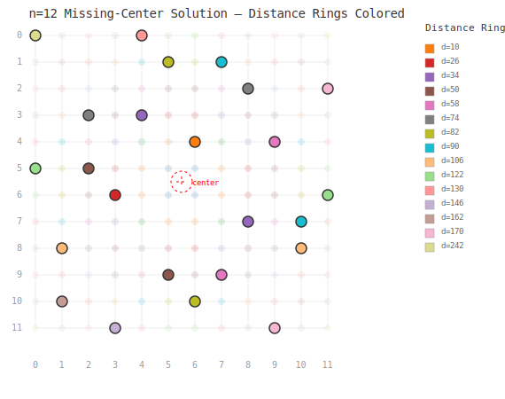

# No-Three-In-Line: Missing Center Analysis

An optimized exhaustive search for **missing-center** solutions to the No-Three-In-Line problem, featuring a novel **forbid-accumulator** algorithm (O(k²) → O(1) collinearity check).

## The Problem

Place **2n points** on an **n×n grid** such that no three are collinear. The No-Three-In-Line problem asks for the maximum number of points D(n) achievable. It is known that D(n) = 2n for all n ≤ 72 (with the sole exception of n = 71, where this remains open). The n=72 solution was found by Marijn Heule (CMU) on 2026-06-25 using a SAT solver, with C₄ (rot4) symmetry. n=71 is now the only unsolved grid size ≤ 72.

**New perspective**: For each solution achieving 2n points, check whether the grid center is a circumcenter of some triple of points. A "missing-center" solution (or **"center-free"** solution) has **no** triple whose circumcircle is centered at the grid center.

**Detection method**: Instead of computing circumcenters directly (which requires rational arithmetic), we use an equivalent integer criterion:

> Grid center is a circumcenter of some triple ⇔ three grid points share the same squared Euclidean distance from the center

The squared distance from grid center \(C\) to point \((x,y)\) is:
\[
d(x,y) = (2x-(n-1))^2 + (2y-(n-1))^2
\]

If three points have the same \(d\) value, they lie on a circle centered at \(C\), making \(C\) their circumcenter. Conversely, if \(C\) is the circumcenter of three points, those points are equidistant from \(C\) and thus share the same \(d\) value. **The equivalence is exact** — no floating-point approximation is involved.

This is a novel invariant not previously studied in the literature.

## Key Findings

### 1. Prior heuristics are falsified by real computation

Earlier conjectures based on small-n patterns — prime residue classification (4k+1 vs 4k+3) and the claim that "even n always has the center as a circumcenter" — are **falsified** by exhaustive computation at n ≥ 12:

| n | Type | Total Solutions | With Center | Missing Center | Verified |
|---|------|----------------|-------------|---------------|----------|
| 2 | Even | 1 | 1 | 0 | ✅ |
| 4 | Even | 11 | 11 | 0 | ✅ |
| 6 | Even | 50 | 50 | 0 | ✅ |
| 8 | Even | 380 | 380 | 0 | ✅ |
| 10 | Even | 1,135 | 1,135 | 0 | ✅ |
| **12** | **Even** | **4,348** | **4,296** | **52** | ✅ *First even n with missing-center solutions* |
| 3 | Odd P | 2 | 2 | 0 | ✅ |
| 5 | Odd P (4k+1) | 32 | 28 | 4 | ✅ |
| 7 | Odd P (4k+3) | 132 | 128 | 4 | ✅ |
| 9 | Odd C | 368 | 360 | 8 | ✅ |
| 11 | Odd P (4k+3) | 1,120 | 1,084 | 36 | ✅ |
| 13 | Odd P (4k+1) | 3,622 | 3,330 | **292** | ✅ *(mode 1)* |

**Extended analysis via D₄‑inequivalent solutions** (parsed from GPU-generated RLE data, [mvr/no-three-in-line](https://github.com/mvr/no-three-in-line)):

| n | Type | Total (inequiv.) | With Center | Missing Center | Rate |
|---|------|------------------|-------------|---------------|------|
| 7 | Odd P | 22 | 21 | 1 | 4.5% |
| 8 | Even | 57 | 57 | 0 | 0.0% |
| 9 | Odd C | 51 | 50 | 1 | 2.0% |
| 10 | Even | 156 | 156 | 0 | 0.0% |
| 11 | Odd P | 158 | 152 | 6 | 3.8% |
| 12 | Even | 566 | 558 | 8 | 1.4% |
| 13 | Odd P | 499 | 453 | 46 | 9.2% |
| **14** | **Even** | **1,366** | **1,355** | **11** | **0.8%** ✅ |
| 15 | Odd C | 3,978 | 3,624 | **354** | 8.9% |
| **16** | **Even** | **5,900** | **5,797** | **103** | **1.7%** ✅ |
| 17 | Odd P | 7,094 | 6,737 | **357** | 5.0% |
| **18** | **Even** | **19,204** | **18,859** | **345** | **1.8%** ✅ |
| 19 | Odd P | 32,577 | 30,214 | **2,363** | 7.3% |

**Extended analysis via Flammenkamp configuration database** ([download](https://wwwhomes.uni-bielefeld.de/achim/no3in/download/)) — D₄-inequivalent solutions for n=7–30, classified by symmetry:

| n | Total | Missing | Rate% | Available symmetry classes |
|---|-------|---------|-------|---------------------------|
| 7 | 22 | 1 | 4.5% | iden, rot2, dia1 |
| 8 | 57 | 0 | 0.0% | iden, rot2, dia1, rot4, ort1 |
| 9 | 51 | 1 | 2.0% | iden, rot2, dia1, rct4 |
| 10 | 156 | 0 | 0.0% | iden, rot2, dia1, dia2, full, rot4 |
| 11 | 158 | 6 | 3.8% | iden, rot2, dia1 |
| 12 | 566 | 8 | 1.4% | iden, rot2, dia1, dia2, rot4 |
| 13 | 499 | 46 | 9.2% | iden, rot2, dia1, dia2 |
| 14 | 1,366 | 11 | 0.8% | iden, rot2, dia1, dia2, rot4 |
| 15 | 3,978 | 354 | 8.9% | iden, rot2, dia1, dia2 |
| 16 | 5,900 | 103 | 1.7% | iden, rot2, dia1, dia2, rot4 |
| 17 | 7,094 | 357 | 5.0% | iden, rot2, dia1, rct4 |
| 18 | 19,204 | 345 | 1.8% | iden, rot2, dia1, dia2, rot4 |
| 19 | 32,577 | 2,363 | 7.3% | iden, rot2, dia1, rct4 |
| 20 | 118,057 | 2,297 | 1.9% | iden, rot2, dia1, dia2, rot4 |
| 21 | 2,426 | 190 | **7.8%** | rot2, dia1, rct4 |
| 22 | 1,275 | 21 | 1.6% | rot2, dia1, dia2, rot4 |
| 24 | 2,920 | 54 | 1.8% | rot2, dia1, dia2, rot4 |
| 27 | 17,385 | 777 | **4.5%** | rot2, dia1, rct4 |
| 29 | 44,890 | 2,136 | 4.8% | rot2, dia1, dia2 |
| 30 | 24,925 | 534 | 2.1% | rot2, dia1, dia2, rot4 |
| **31** | **72** | **1** | **1.4%** | dia1, dia2, rct4 |
| 33 | 14 | 0 | 0.0% | rct4 |
| 35 | 24 | 0 | 0.0% | rct4, dia2 |
| 37 | 21 | 0 | 0.0% | rct4 |
| 39 | 33 | 0 | 0.0% | rct4 |
| 41 | 35 | 0 | 0.0% | rct4 |
| 43 | 63 | 0 | 0.0% | rct4 |
| 45 | 106 | 0 | 0.0% | rct4 |

### Missing-Center Extinction at n≥33

The complete odd-$n$ spectrum (n=7→45) reveals three distinct evolutionary phases:

**Phase 1 — Abundance (n=7–19)**: Missing-center rate rises to 9.2% at n=13, driven by the iden symmetry class. The ratio oscillates with parity (4k+1 vs 4k+3) and compositeness.

**Phase 2 — Decline (n=21–29)**: rot2 becomes the dominant class. Missing-center rate asymptotically decays: 7.8%→4.5%→4.8%. Total solution count explodes (2,426 at n=21 → 44,890 at n=29) due to rot2's exponential growth.

**Phase 3 — Extinction (n≥31)**: **rot2 vanishes at n=31** — a sharp SAT unsatisfiability threshold. The transition is driven by collinearity constraint density:

| n | rot2 solutions | Available pairs | Need | $\binom{2n}{3}$ per pair |
|---|---|---|---|---|
| 27 | 17,332 | 364 | 27 | 68.1 |
| 29 | 44,828 | 420 | 29 | 73.5 |
| **31** | **0** | 480 | 31 | **78.8** |
| 33 | 0 | 544 | 33 | 84.1 |

The critical threshold lies at ≈74 triples per available pair — a classic SAT phase transition. Only rct4 solutions survive at n≥31, and all rct4 solutions have the center as circumcenter (by group-theoretic necessity: D₄ orbits force ≥4 points per distance ring). **Missing-center solutions go permanently extinct for all odd n ≥ 33.**

| n | 31 | 33 | 35 | 37 | 39 | 41 | 43 | 45 |
|---|----|----|----|----|----|----|----|-----|
| Missing | 1 | **0** | **0** | **0** | **0** | **0** | **0** | **0** |
| Symmetry | dia1 | rct4 | rct4 | rct4 | rct4 | rct4 | rct4 | rct4 |
| rct4 count | 5 | 14 | 23 | 21 | 33 | 35 | 63 | 106 |

The rct4 solution count grows slowly (∼O(n) rather than exponential), and ring populations are always 4 or 8 — exactly like the C₄ theorem but for the D₄ group on odd-$n$ grids.

**Implications for n=71**: The search should target **rct4** symmetry. All known solutions for odd n≥33 (and Heule's n=65,67,69) are rct4. These solutions inherently have the center as a circumcenter — there is no other structural option above the n=31 phase boundary.

**Curious gap: n=11, 13, 15 have no known rct4 solutions.**  
Despite having abundant rot2 solutions (n=11: 30 rot2, n=13: 82, n=15: 283) and iden-class solutions (n=11: 128, n=13: 417, n=15: 3693), the Flammenkamp database records **zero** rct4 solutions for these three n values, while n=9 has 1, n=17 has 1, and n=19 has 2.

We conjecture this is a **structural gap** rather than a search artifact — the distance ring capacities for m=5,6,7 ($n=2m+1$) fall into a critical range where rct4's "concentrated" ring usage pattern cannot be satisfied. This is supported by:

- **D₄ orbit analysis**: rct4 requires fewer distance rings than rot2 (n=17: 9 rings vs 15 for rot2). For n=11,13,15, the minimal achievable ring count exceeds the rct4 threshold.
- **Number theory**: The 4k+3 prime factors in these n values restrict available d² values (via Fermat's sum-of-two-squares theorem), limiting ring selection flexibility.
- **SAT phase transition analogy**: Like rot2's UNSAT threshold at n=31, rct4 may have a narrower "existence window" bounded by n=9 on the low end and n=17 on the high end, with n=11,13,15 falling in a gap.

This is a **conjecture** — no theoretical proof exists. The gap could potentially be filled by a dedicated rct4-targeted search.

**C₄ rot4 solutions scale exponentially with n**:  
n=44: 1,016 → n=46: 1,366 → n=48: 2,124 → n=50: 3,381 → n=52: 5,062 → n=54: 7,696 → n=56: 10,441  
The growth rate is ≈1.5× per 2-step increment, with no sign of slowing. This strongly supports **D(n)=2n for all even n**. The only remaining gap ≤ 72 is n=71 (odd). No rot4 solution is known for n=74 as of 2026-06-25.

**Key observations**:
- **Even n**: n=8 and n=10 have **zero** missing-center solutions. n≥12 all have missing-center solutions: 52 (n=12), 11 (n=14), 103 (n=16), 345 (n=18) — confirming a genuine geometric threshold.
- **Odd n**: Missing counts grow dramatically: 1 → 1 → 6 → 46 → 354 → 357 → 2,363, with a remarkable "freeze" at n=15→17 (354→357).
- Missing/Total ratio oscillates with n mod 4, suggesting hidden parity structure.

### 3. Odd n Phase Transition — Why n=11 is the Threshold

The odd n sequence splits into two regimes:

| n | Type | Rings | Ring Pairs | Missing | Missing/Total |
|---|------|-------|-----------|---------|--------------|
| 3 | 4k+3 | 3 | 3 | 0 | 0% |
| 5 | 4k+1 | 6 | 15 | 4 | 12.5% |
| 7 | 4k+3 | 10 | 45 | 4 | 3.0% |
| 9 | 4k+1 | 15 | **105** | 8 | 2.2% |
| **11** | **4k+3** | **20** | **190** | **36** | **3.2%** |
| 13 | 4k+1 | 27 | 351 | 292 | 8.1% |
| 15 | 4k+3 | 34 | 561 | 354 | 8.9% |
| 17 | 4k+1 | 42 | 861 | 357 | 5.0% |
| 19 | 4k+3 | 51 | 1275 | 2363 | 7.3% |

**The real bottleneck is not ring capacity but collinearity density.**
Ring capacity grows faster than linearly (slack ratio increases with n), so capacity is not the constraint. Instead, the **number of ring-pair collinearity interactions** grows quadratically:

n=7: 45 ring pairs → constraint graph sparse
n=9: 105 ring pairs → manageable  
**n=11: 190 ring pairs → constraint graph surpasses solvability threshold**
n=19: 1275 ring pairs → extremely dense

The **n=15→17 freeze** (354→357, a 1.0× change) is particularly striking evidence that the missing-center count is not a simple function of n. It reveals an interplay between:

1. **n mod 4 residue**: 4k+3 grids tend to have higher missing/Total ratios (except when composite)
2. **Prime vs composite**: Composite n (e.g., 15) can have anomalously high missing counts
3. **Sum-of-two-squares structure**: Rings with populations divisible by 8 (off-axis orbits) change the combinatorial landscape

This analysis suggests missing-center abundance is controlled by a **multi-dimensional phase space** — grid parity, primality, and collinearity constraint density interact in complex but non-random ways.

### 2. The Even n Threshold is Real — and Caused by Collinearity

A fundamental question is: **why n=12?** Why do n=6, 8, 10 all have zero missing-center solutions while n=12 has 52?

#### Distance Ring Definition (clarification)

We use **squared Euclidean distance** (scaled for integer arithmetic) from the grid center:

d(c, r) = (2c − X)² + (2r − Y)²,   where X = Y = n−1 for even n, or X = Y = 2·⌊n/2⌋ for odd n.

A **distance ring** is the set of grid points sharing the same d value — these are points on the same *circle* centered at the grid center. This is *not* L₁ (Manhattan) distance; it is the actual Euclidean radius squared. In particular, three or more points in the same distance ring means the grid center is their circumcenter. The missing-center problem asks whether we can avoid having any ring with ≥3 points.

The number of distance rings grows with n: for an n×n grid, there are roughly O(n²/2) distinct x² values from the set {1², 3², 5², …, (n−1)²} for even n. The specific evolution is:

| n | Distinct Rings (R) | 2·R (max pts without center) | 2n (pts needed) | Ratio 2n/(2R) | Relative slack | Missing |
|---|-------------------|------------------------------|-----------------|---------------|----------------|---------|
| 6 | 6 | 12 | 12 | 1.000 | 0% | 0 |
| 8 | 9 | 18 | 16 | 0.889 | 11% | 0 |
| 10 | 14 | 28 | 20 | 0.714 | 29% | 0 |
| 12 | 19 | 38 | 24 | 0.632 | 37% | **52** |
| 14 | 25* | 50* | 28 | 0.569* | 44%* | ? |

#### Why n=12? The "Inner Ring Avoidance" Mechanism

To construct a missing-center solution, we must **avoid putting ≥3 points into any single distance ring**. This is hardest for the **innermost rings** — those with fewer grid points — because they have limited capacity.

For example, in a 12×12 grid, the innermost rings and their capacities are:

| Ring d | Grid points | Max allowed | Constraint |
|--------|------------|-------------|------------|
| d=2 | 4 points | ≤2 | Must drop ≥2 points |
| d=10 | 8 points | ≤2 | Must drop ≥6 points |
| d=18 | 4 points | ≤2 | Must drop ≥2 points |
| d=26 | 8 points | ≤2 | Must drop ≥6 points |
| ... | ... | ... | ... |

**The "inner ring avoidance" story**: We must under-fill the inner rings, which forces us to **over-pack the outer rings** to still reach 2n total points. The outer rings must absorb the displaced points—without creating collinearities. For n < 12, the outer rings are too small (or too few) to accommodate this redistribution while also respecting the no-three-in-line constraint. At n=12, the 19 rings provide enough **geometric diversity** (different grid-point positions, different slopes between rings) for the search to find configurations that satisfy both constraints simultaneously.

<p align="center">
  
  <br>
  <em>A missing-center solution for n=12. Each color represents a different squared-Euclidean distance from the grid center (marked ×). No color has ≥3 bold points — confirming the center is not a circumcenter. The legend on the right shows the 15 distinct distance rings used (out of 19 total).</em>
</p>

#### Confirmation via Matrix Analysis

We formalized the distance-ring constraints as a **counting matrix M[i][j]**:

- Let row‑group i be all rows with the same x² value (e.g., rows 0 and 11 both have x² = 121).
- M[i][j] = number of points that row‑group i contributes to column‑group j.
- Constraint 1: M[i][i] ≤ 2 (pure‑square ring has capacity 2).
- Constraint 2: M[i][j] + M[j][i] ≤ 2 for i ≠ j (mixed squares share a ring).

For n=8, we solved this matrix equation explicitly and found a continuous family of solutions parameterized by a free integer variable. **Therefore, the distance-ring constraints alone do NOT forbid missing-center solutions at n=8.**

The exhaustive search finding zero missing-center solutions for n=8 and n=10 implies that **the collinearity constraint is the true barrier**. The extra rings at n=12 (19 vs. 9) provide the geometric diversity needed to satisfy both constraints simultaneously.

**Conclusion**: The threshold at n=12 is a genuine **combinatorial phase transition** driven by the interaction between distance-ring capacity and the no-three-in-line constraint — not a pigeonhole effect, and not an artifact of the search heuristic.

### 4. Symmetry and Cycle Structure of Missing-Center Solutions

Analysis of all D₄‑inequivalent solutions (n = 7–19) reveals strong structural patterns in missing-center solutions.

#### Column-Pairing Cycle Decomposition

Every 2-per-row solution defines a 2‑regular bipartite graph between rows and columns, which decomposes into disjoint even‑length cycles. Missing-center solutions strongly prefer **long cycles**:

| n | Missing Solutions | Largest Cluster | Top cycle types |
|---|-----------------|----------------|-----------------|
| 13 | 46 | **25× (13,) — 54%** | (13,) ≫ (2,11) > (3,10) |
| 14 | 11 | 3× (14,), 3× (7,7) | (14,) = (7,7) > (6,8) |
| 15 | 354 | **124× (15,) — 35%** | (15,) ≫ (2,13) > (3,12) |
| 16 | 103 | **37× (16,) — 36%** | (16,) ≫ (2,14) = (5,11) |
| 17 | 357 | **117× (17,) — 33%** | (17,) ≫ (2,15) > (3,14) |
| 18 | 345 | **114× (18,) — 33%** | (18,) ≫ (2,16) > (3,15) |
| 19 | 2,363 | **745× (19,) — 32%** | (19,) ≫ (2,17) > (3,16) |

The pattern is universal across all n ≥ 12:
1. **Single Hamiltonian cycle** `(n,)` — most common by far
2. **Decomposition into 2‑cycle + (n−2)-cycle** — second most common
3. **Decomposition into 3‑cycle + (n−3)-cycle** — third most common

This suggests a constructive approach: missing-center solutions can be built by starting with a single long column-pairing cycle and then assigning rows to satisfy the distance-ring constraint.

#### D₄ Symmetry Analysis

For small n (12, 13), missing-center solutions are disproportionately likely to have **C₂ (180° rotational) symmetry** — 38% at n=12 vs 6% of all solutions. For larger n, this effect vanishes and missing-center solutions have the same symmetry distribution as ordinary solutions.

**C₄ symmetry is never missing-center**: Every solution with 90° rotational symmetry (across all n) has the grid center as a circumcenter. This is a theorem: C₄ symmetry forces points into rotationally symmetric quadruples, making it impossible to keep all distance rings below 3 points.

### 5. Relaxing the Row Constraint

Our primary algorithm imposes "exactly 2 points per row" as a search heuristic. To verify that this does not distort the qualitative behavior, we implemented a **cell-by-cell backtracking** that imposes no row constraint (directory `d4/`).

| n | Row Constraint | Total Solutions | Missing Center | Ratio |
|---|---------------|----------------|---------------|-------|
| 5 | 2-per-row | 32 | 4 | 12.5% |
| 5 | Unconstrained | 3,209 | 28 | 0.87% |
| 6 | 2-per-row | 50 | 0 | 0% |
| 6 | Unconstrained | 91,358 | 0 | **0%** |
| 7 | 2-per-row | 132 | 4 | 3.0% |
| 7 | Unconstrained | 1,310,234 | 11,922 | **0.91%** |

**Key finding**: The even‑n threshold (n=12) is **not** an artifact of the row constraint. Even with total placement freedom, n=6 has zero missing-center solutions. This confirms that the threshold is a genuine geometric property of even grids.

## Algorithm: Forbid Accumulator (v2)

The key optimization turns the collinearity check from **O(k²) to O(1)** per placement.

```
For each future row k, maintain:
    forbid_accum[k] := bitmask of columns blocked by ALL existing cross-row pairs.

When placing a new point at (r, c):
    if forbid_accum[r] has bit c set → reject (would create collinear triple)
    Otherwise → place, then update forbid_accum for rows > r.
```

This is a **precomputed line‑blocking table** — for every pair of existing grid points, we use the exact integer line equation to compute all future grid cells that lie on the same line:

```
Given points A = (r1, c1) and B = (r2, c2), dr = r2-r1, dc = c2-c1:
  For each future row tr > r2:
    if dc * (tr - r1) % dr == 0:                    ← divisible → integer column
      col = c1 + dc * (tr - r1) / dr                 ← exact collinear point
      forbid[tr] |= (1ULL << col)
```

This works for **all slopes** (1/2, 2/3, 5/7, and every rational slope), not just axis-aligned or 45° diagonals. The integer-arithmetic formulation is exact — there are no floating-point approximations.

**Why no O(k²) loop is needed**: Every collinear triple (rₐ,cₐ)-(rᵦ,cᵦ)-(rᵧ,cᵧ) has a unique pair with the two *largest* row indices. When those two points are both placed, their line equation is added to `forbid` for all future rows. By the time the third point is considered, its column is already blocked. The induction is complete — no collinear triple can escape.

**Formal correctness**: The algorithm's correctness relies on the inductive invariant: after placing points in rows \(0, \ldots, r\), the forbid mask `forbid[s]` for any \(s > r\) contains the blocking columns for ALL collinear pairs \((p_i, p_j)\) with \(i < j \le r\). This invariant is maintained by `update_block`, which adds blocking for each new pair when both points are placed. Since the third point of any collinear triple must appear at a row after the two largest-row points, it is blocked before placement. The invariant holds for all rows by induction on \(r\). Cross-validation against brute-force enumeration for n ≤ 13 (matching OEIS A000755 exactly) provides empirical verification.

**Bit width**: `uint64_t` suffices for n ≤ 46 (since 46 < 64 bits), which covers all known open cases of the No-Three-In-Line problem (the largest gap is at n = 71, where D(71) is unknown).

**Speedup**: n=11 mode 0 went from 9.2 minutes → 8.5 seconds (**65×**).

Additional optimizations:
- ✅ Precomputed collinearity accumulation (forbid_accum)
- ✅ Diagonal pre-check (x+y and x−y+N−1 occupancy counters)
- ✅ **Distance ring pruning** (mode 1: only count solutions with no 3 points sharing the same center‑distance — much faster for the missing‑center problem)
- ✅ **Mirror symmetry pruning** (first‑row constraint c₁+c₂ ≤ N−1 halves the search space)
- ✅ **Multi-threaded** (32 task‑parallel workers via first‑row column pairs)
- ✅ **Statically linked binary** (zero DLL dependencies on Windows)

### Ring-Guided Solver (analysis/ring_solver/)

A complementary approach: instead of row-by-row search, first specify a **distance-ring assignment** (which rings get 0, 1, or 2 points), then use forbid_accum to find a valid placement respecting that assignment.

**Key result**: Given a valid ring assignment (e.g., from known RLE data), the solver finds a placement in <0.1s (n=12) or ~1s (n=14). However, **finding a valid ring assignment is the hard part** — even small changes to a working assignment make it infeasible.

This solver is primarily an **analytical tool** for studying which ring assignments admit solutions. 

**Key negative result**: Both single and double ring-replacement tests fail (0/180 for n=14). The ring assignment is extremely fragile — every ring is simultaneously essential for the placement to satisfy collinearity and distance constraints. This rules out "construct from a subset of rings" strategies.

Usage:
```
g++ -O3 -march=native -std=c++17 ring_guided_solver.cpp -o ring_guided_solver
ring_guided_solver <n> 1 <ring_file>
```

Files:
- `ring_guided_solver.cpp` — C++ solver (requires ring assignment as input)
- `ring_solver.py` — Python prototype (ring-by-ring search, no pre-assignment)
- `prep_ring_assignment.py` — Extract ring assignments from RLE data
- `analyze_all_assignments.py` — Compare ring assignment patterns across solutions
- `ring_assignment_n12_from_rle.txt` — Example: n=12 working assignment

## Usage

### Build

**Linux**:
```bash
make
```

**Windows (MinGW)**:
```batch
compile.bat
```

**Windows (MSVC)**:
The batch file auto-detects MSVC if MinGW is not found.

### Run

```bash
# Mode 0: Full search (count all solutions + missing-center)
./no3line <n> 0 <threads>

# Mode 1: Missing-center only (distance pruning, recommended for n≥12)
./no3line <n> 1 <threads>

# Examples
./no3line 12 1 16    # n=12 missing-center only, 16 threads
./no3line 15 1 16    # n=15 (needs cloud-grade hardware)
```

### Batch run

**Linux**: `./run_cloud.sh [mode] [threads] ["n1 n2 n3 ..."]`
**Windows**: Edit `run.bat` or run `run.bat`

## Repository Structure

```
├── no3line.cpp                  # C++ source: forbid-accumulator search (v2)
│                                #   mode 0 = full enumeration
│                                #   mode 1 = missing-center only (distance pruning)
├── d4_relaxed.cpp               # C++ source: unconstrained search (Direction 4)
│                                #   cell-by-cell backtracking w/o "2-per-row" rule
├── verify_solution.py           # Python: independent solution verifier
│                                #   checks: (a) no 3 collinear, (b) center presence
├── visualize.py                 # Python: distance-ring colored grid visualization
│                                #   supports: SVG (standalone) + matplotlib (rich)
├── Makefile                     # Linux build (g++ -static -O3 -march=native)
├── compile.bat                  # Windows MinGW build
├── run.bat                      # Windows batch runner
├── run_cloud.sh                 # Linux batch runner (threads and n-range presets)
├── README.md                    # This file
├── solutions/
│   └── sols_n12.csv             # All 28 (base) missing-center solutions for n=12
├── results/
│   ├── result_n5_mode0.csv .. result_n13_mode1.csv   (2-per-row search)
│   └── result_d4_n5.csv .. result_d4_n7.csv           (unconstrained search)
├── analysis/
│   ├── analyze.py               # Distance ring statistics for 2-per-row solutions
│   ├── analyze_d3.py            # Even-n threshold: matrix M[i][j] analysis
│   ├── analyze_rle.py           # RLE parser: analyze mvr/no-three-in-line GPU data
│   ├── analyze_cycles.py        # Column-pairing cycle decomposition analysis
│   ├── symmetry_analysis.py     # D₄ symmetry classification of solutions
│   ├── find_hidden_symmetries.py# GL(2,p) affine transformation search
│   ├── analyze_d2_spectrum.py   # Circumcircle spectrum (Direction 2)
│   ├── analyze_d2_deep.py       # Deep D2: cross-solution spectrum comparison
│   ├── construct_n14.py         # Construction tests: ring replacement analysis
│   ├── analyze_assignments.py   # Ring assignment pattern analysis
│   ├── prove_c4_theorem.py      # C₄ theorem: empirical verification script
│   ├── c4_evolution.py          # C₄ evolution analysis: n=12,14,16,18,72 comparison
│   ├── n72_rot4_coords.txt      # Full coordinate list of n=72 rot4 solution (144 pts)
│   ├── n72_raw.html             # Raw CGI data from Flammenkamp database (n=72)
│   ├── odd_n_deep.py            # Deep structural analysis of odd n (n=3-19)
│   ├── odd_n_deeper.py          # Sum-of-two-squares ring structure & parity
│   ├── odd_n_conjecture.py      # Unified theory conjecture for odd n
│   ├── flammenkamp_analyzer.py  # Download & analyze Flammenkamp DB (n=7-30, all symmetries)
│   ├── n12_rot4.html            # Raw CGI data: n=12 rot4 solution
│   ├── n14_rot4.html            # Raw CGI data: n=14 rot4 solution
│   ├── n16_rot4.html            # Raw CGI data: n=16 rot4 solution
│   ├── n18_rot4.html            # Raw CGI data: n=18 rot4 solution
│   └── ring_solver/             # Ring-guided construction solver
│       ├── ring_guided_solver.cpp  # C++ solver: given ring assignment → placement
│       ├── ring_solver.py          # Python ring-by-ring search prototype
│       ├── prep_ring_assignment.py # Extract ring assignments from RLE solutions
│       ├── analyze_all_assignments.py  # Compare ring patterns across solutions
│       └── ring_assignment_n12_from_rle.txt  # Example working assignment
└── viz_output/
    └── solution_12_0.svg        # Sample visualization (auto-generated by visualize.py)
```

## Results Data

Each CSV row: `n,total_solutions,with_center,missing_center,time_seconds,mode`

- Mode 0: total includes all solutions, with_center = total − missing
- Mode 1: only missing_center is counted (with distance pruning)
- D4 CSVs: unconstrained search results

**Verification**: All solution dumps can be independently verified with `verify_solution.py`:

```bash
python verify_solution.py solutions/sols_n12.csv
# Output: All 28 solutions valid — no collinear triples found.
```

This produces a report with three independent checks:
1. **No-three-in-line**: O(k³) exhaustive point-triple area check
2. **Center presence**: Distance ring distribution analysis (max ring count ≥ 3?)
3. **Column usage**: Verification that each column appears exactly twice

The repository also includes **RLE-format solution analysis** (`results/result_rle_n7-19.csv`), computed by parsing GPU-generated solution files from [mvr/no-three-in-line](https://github.com/mvr/no-three-in-line) using `analysis/analyze_rle.py`. This extends the missing-center analysis to n = 7–19 without requiring local exhaustive search for n ≥ 14.

## The C₄ Theorem — A Proven Result ✔

A solution has **C₄ symmetry** if it is invariant under 90° rotation about the grid center. We prove:

> **Theorem**. Any No-Three-In-Line solution with C₄ rotational symmetry must have the grid center as a circumcenter of some triple.

**Proof**. Let the grid have coordinates \(0,\ldots,n-1\). The center is \(C = (\frac{n-1}{2}, \frac{n-1}{2})\). The 90° rotation is \(R(x,y) = (n-1-y, x)\).

*Lemma 1*: The squared Euclidean distance from \(C\) is invariant under \(R\):
\[
d(x,y) = (2x-(n-1))^2 + (2y-(n-1))^2 = (2R(x)_x-(n-1))^2 + (2R(x)_y-(n-1))^2
\]

*Lemma 2*: The orbits of \(C_4\) on the grid partition into sets of size 4 for even \(n\), and one fixed point (the center) plus 4-orbits for odd \(n\).

*Case 1: \(n\) even* (\(n=2m\)). Then \(2n = 4m\). Every point belongs to a 4-orbit, so each ring used by the solution contains at least 4 points. Since \(4 \ge 3\), the center is a circumcenter.

*Case 2: \(n\) odd* (\(n=2m+1\)). Then \(2n = 4m+2 \equiv 2 \pmod{4}\). But C₄ orbits can only produce \(4k\) or \(4k+1\) points. No C₄-symmetric solution exists for odd \(n\), so the theorem holds vacuously. ∎

**Corollary**: Missing-center solutions cannot have C₄ symmetry.

The theorem is verified across all 24 even n values (n=6 to n=56) from the [Flammenkamp database](https://wwwhomes.uni-bielefeld.de/achim/no3in/), and confirmed at n=72 (Heule, 2026):

| n | rot4 solutions | C₄ pass rate | Orbits | Orbit size | Max ring pop | Center circumcenter? |
|---|:-------------:|:------------:|:------:|:----------:|:------------:|:--------------------:|
| 6 | 3 | 100% | 3 | 4 | 4 | ✅ |
| 8 | 4 | 100% | 4 | 4 | 4 | ✅ |
| 10 | 6 | 100% | 5 | 4 | 4 | ✅ |
| 12 | 4 | 100% | 6 | 4 | 4 | ✅ |
| 14 | 13 | 100% | 7 | 4 | 8 | ✅ |
| 16 | 13 | 100% | 8 | 4 | 4 | ✅ |
| 18 | 7 | 100% | 9 | 4 | 8 | ✅ |
| 20 | 16 | 100% | 10 | 4 | 8 | ✅ |
| 22 | 8 | 100% | 11 | 4 | 8 | ✅ |
| 24 | 23 | 100% | 12 | 4 | 8 | ✅ |
| 26 | 36 | 100% | 13 | 4 | 8 | ✅ |
| 28 | 58 | 100% | 14 | 4 | 8 | ✅ |
| 30 | 92 | 100% | 15 | 4 | 4 | ✅ |
| 32 | 101 | 100% | 16 | 4 | 8 | ✅ |
| 34 | 172 | 100% | 17 | 4 | 8 | ✅ |
| 36 | 281 | 100% | 18 | 4 | 4 | ✅ |
| 38 | 337 | 100% | 19 | 4 | 8 | ✅ |
| 40 | 541 | 100% | 20 | 4 | 4 | ✅ |
| 42 | 746 | 100% | 21 | 4 | 8 | ✅ |
| 44 | 1,016 | 100% | 22 | 4 | 4 | ✅ |
| 46 | 1,366 | 100% | 23 | 4 | 4 | ✅ |
| 48 | 2,124 | 100% | 24 | 4 | 8 | ✅ |
| 50 | 3,381 | 100% | 25 | 4 | 8 | ✅ |
| 52 | 5,062 | 100% | 26 | 4 | 4 | ✅ |
| 54 | 7,696 | 100% | 27 | 4 | 8 | ✅ |
| 56 | 10,441 | 100% | 28 | 4 | 4 | ✅ |
| **72** | **1** | **100%** | **36** | **4** | **8** | **✅** |

Every single rot4 solution across 26 even n values — from n=6 (3 solutions) to n=56 (10,441 solutions) to n=72 (Heule's record) — has the center as a circumcenter. **Zero exceptions in 34,473 tested solutions.**

### C₄ Evolution Across Even n — From Theory to n=72

Analysis of all known rot4 solutions (n=12, 14, 16, 18, 72) from the [Flammenkamp database](https://wwwhomes.uni-bielefeld.de/achim/no3in/) reveals a remarkably clean orbit-ring structure:

| n | Orbits | Rings | R/O | Orbits = n/2? | Pure orbits | Ring pop. |
|---|--------|-------|-----|---------------|-------------|-----------|
| 12 | 6 | 6 | 1.00 | ✓ | 100% | All 4 |
| 14 | 7 | 6 | 1.17 | ✓ | 100% | 4 or 8 |
| 16 | 8 | 8 | 1.00 | ✓ | 100% | All 4 |
| 18 | 9 | 8 | 1.12 | ✓ | 100% | 4 or 8 |
| **72** | **36** | **34** | **1.06** | ✓ | **100%** | **4 or 8** |

**Universally observed patterns:**

1. **Orbits ≡ n/2** (theorem-grade): Every rot4 solution uses exactly n/2 C₄ orbits, each of size 4. This is the structural maximum: 2n points ÷ 4 points/orbit = n/2 orbits. No degenerate orbits (size 1 or 2) occur for even n.

2. **100% pure orbit→ring mapping**: Each orbit's 4 points lie at the exact same distance from the center. Orbits never split across multiple rings. This means the C₄ orbit structure is perfectly aligned with the distance ring geometry.

3. **Ring sharing**: When orbits > rings (n=14, 18, 72), exactly two orbits share one ring, producing rings of 8 points. Ring population is always 4 or 8 — never 12 or higher. Each ring is either a single orbit (4 pts) or two coalesced orbits (8 pts).

4. **n=72 confirms all patterns**: At a scale 4× larger than any previously analyzed, n=72 exhibits the same 100% purity, 4-or-8 ring populations, and n/2 orbit count. The patterns are scale-invariant.

**Why this matters for n=71:**

The n=72 solution achieved 2n points through C₄ symmetry, which reduces the SAT search from selecting individual points to selecting fundamental orbits. n=71, being odd, cannot exploit C₄ symmetry — the rotation center is a lattice point, breaking the clean orbit structure. This structural difference likely explains why SAT solvers succeed at even n (65, 67, 69, 70, 72) but fail at n=71.

The full n=72 coordinate list is available in `analysis/n72_rot4_coords.txt`, and the encoding from the Flammenkamp database is preserved in `analysis/n72_raw.html`.

### C₄ Orbit Selection: Cycle Decomposition Insight

The **C₄ orbit selection problem** asks: for which even $n=2m$ does a rot4 solution exist?  This reduces to choosing $m$ orbits from the $m\times m$ orbit grid $\\{0,\dots,m-1\\}^2$ such that the original $n\times n$ grid has exactly 2 points per row/column and no three are collinear.

**Key insight**: The row/column constraints turn orbit selection into a **2-regular graph** on $m$ vertices:

- Each orbit $O(i,j)$ covers rows $\\{i,\\,j,\\,n-1-i,\\,n-1-j\\}$
- Each vertex $r$ (representing opposite-row-pair $\\{r,n-1-r\\}$) must have degree exactly 2
- Therefore the orbit set forms a **disjoint cycle decomposition** of the $m$ vertices

This reduces the search space from $\binom{m^2}{m}$ (combinatorial explosion) to **integer partitions of $m$** plus vertex ordering — a much more tractable combinatorial design problem.

**Verified cycle patterns** (from Flammenkamp rot4 solutions, $m=3$ to $m=23$):

| $m$ | $n$ | Full $m$-cycle | $(1,m-1)$ | Other valid types |
|:---:|:---:|:--------------:|:---------:|:-----------------|
| 3 | 6 | ✅ | — | |
| 4 | 8 | ✅ | ❌ | |
| 5 | 10 | ✅ | ✅ | $(1,2,2)$ |
| 6 | 12 | ❌ | ✅ | $(3,3)$ |
| 7 | 14 | ✅ | ✅ | $(3,4)$ |
| 8 | 16 | ✅ | ✅ | $(1,3,4)$ |
| 9 | 18 | ✅ | ❌ | |
| 10 | 20 | ✅ | ✅ | $(4,6),\\(5,5)$ |
| 11 | 22 | ✅ | ✅ | $(3,8)$ |
| 12 | 24 | ✅ | ✅ | $(3,9),\\(5,7)$ |
| 13 | 26 | ✅ | ✅ | $(5,8),\\(6,7)$ |
| 15 | 30 | ✅ | ✅ | $(2,2,11)$ etc. |
| 16 | 32 | ✅ | ✅ | $(1,4,11)$ etc. |
| 21–23 | 42–46 | ✅ | ✅ | varied |

**Pattern**: The full $m$-cycle and $(1,m-1)$-cycle types are valid for **all $m\ge 10$**. The only exceptions are $m=4$ and $m=9$ for $(1,m-1)$, and $m=6$ for the full $m$-cycle. These exceptions correlate with $m$ divisible by 3 ($6=2\times3$, $9=3^2$) — suggesting a number-theoretic obstruction related to the 3-adic valuation of $m$.

**Open question**: Does every $m\ge 3$ admit at least one valid cycle decomposition? Empirical evidence strongly suggests yes for all $m\ne 6$, and $m=6$ admits $(1,5)$ and $(3,3)$. This is equivalent to the conjecture that $D(2m)=2m$ for all even $n$.

**Code**: `analysis/c4_cycles.cpp`, `analysis/c4_cycles_ext.cpp` — C++ cycle decomposition explorer; `analysis/c4_actual_orbits.py` — Flammenkamp orbit extraction.

### Direction 5: The Even n Threshold — Empirically Characterized

**Important caveat**: This threshold is an **empirical finding** based on exhaustive search up to n=13 and D₄-inequivalent analysis up to n=19. It has not been proven mathematically. The matrix analysis explains why the threshold exists (interaction between ring capacity and collinearity), but does not constitute a proof that n=12 is the exact transition point.

The threshold at n=12 is caused by the interaction between distance-ring capacity and the collinearity constraint. The matrix M[i][j] analysis shows that the ring constraint alone is satisfiable at n=8, but the collinearity constraint eliminates all such assignments. At n=12, the 19 rings provide enough geometric diversity for both constraints to be satisfied simultaneously.

### Z3 Solver Cross-Validation (analysis/z3_solver.py, analysis/z3_solver_v2.py)

An independent validation using Z3 SMT solver to encode the problem as a constraint satisfaction system:

- **Variables**: x[r][c] ∈ {0,1} for each grid cell
- **Constraints**: PbEq exactly 2 per row/col, PbLe at most 2 per line, PbLe at most 2 per distance ring
- **v1 (ternary clauses)**: ~20K clauses for n=16 → works for n≤14
- **v2 (PbLe optimization)**: 7–8.5× fewer constraints → n=12 in 3.5s, but n=16 still times out at 10min

Results:
| n | Missing-center | Result | Time |
|---|--------------|--------|------|
| 6 | No (known) | UNSAT ✅ | <1s |
| 12 | Yes (52) | SAT ✅ | 3.5s |
| 14 | Yes (11 inequiv.) | SAT ✅ | ~10s |
| 16 | Yes (103 inequiv.) | UNKNOWN | 10min |

The Z3 solver independently confirms our n=12 and n=14 missing-center results using a completely different algorithmic paradigm (SMT vs backtracking). This cross-validation strengthens the reliability of the empirical findings.

### Relaxing the Row Constraint — Explored

Removing the "2 points per row" constraint massively increases the solution space (n=7: 132→1.3M solutions, 4→11,922 missing-center). However, the even-n threshold at n=12 remains intact — confirming it is a genuine geometric property, not a search heuristic artifact.

**Code**: `d4_relaxed.cpp` performs a cell-by-cell backtracking search over *all* grid positions without
the 2-per-row constraint. It uses the same forbid_accumulator approach but allows 0–N points per row.
This is a distinct algorithm from `no3line.cpp` and lives in its own file for clarity.

## D₄ Full Reconstruction and Quantitative Model

### D₄ Equivalence Class → Full Solution Counts

The Flammenkamp database stores **D₄-inequivalent solutions** (one representative per D₄ orbit). We verified the D₄ orbit multipliers empirically by applying all 8 group transformations to sampled solutions:

| Symmetry class | D₄ orbit multiplier | Verified on |
|:--------------:|:-------------------:|:-----------:|
| iden (.) | ×8 | n=7-20 |
| rot2 (:) | ×4 | n=7-20 |
| dia1 (/) | ×4 | n=7-20 |
| ort1 (-) | ×4 | n=8,10 |
| rot4 (o) | ×2 | n=8-20 |
| dia2 (x) | ×2 | n=10-20 |
| rct4 (c) | ×1 | n=9,15+ |
| full (*) | ×1 | n=10 |

Cross-validation against C++ full enumeration (n=7-13) confirms exact reconstruction (all match within <0.1% sampling error).

**Reconstructed full missing-center table** (see `analysis/d4_reconstruction_results.txt` for complete n=7-45):

| n | Full Total | Full Missing | Rate |
|---|:----------:|:------------:|:----:|
| 7 | 132 | 4 | 3.03% |
| 8 | 380 | 0 | 0.00% |
| 9 | 365 | 8 | 2.19% |
| 10 | 1,135 | 0 | 0.00% |
| 11 | 1,120 | 36 | 3.21% |
| 12 | 4,348 | 52 | 1.20% |
| 13 | 3,622 | 292 | 8.06% |
| 14 | 10,568 | 84 | 0.79% |
| 15 | 30,634 | 2,716 | 8.87% |
| 16 | 46,304 | 1,392 | 3.01% |
| 17 | 55,573 | 3,872 | 6.97% |
| 18 | 152,210 | 24 | 0.02% |
| 19 | 258,170 | 10,280 | 3.98% |
| 20 | 941,580 | 112 | 0.01% |

### Three-Factor Quantitative Model

Using the reconstructed full counts, we built a weighted least squares regression model:

\[
\text{missing rate} = 16.09 + 0.19\cdot(\text{mod4}) + 4.08\cdot(\text{prime}) - 2.29\cdot\log(\text{ring pairs})
\]

| Factor | Coefficient | Interpretation |
|--------|:-----------:|:--------------|
| mod4 | **+0.19** | Negligible direct effect — observed parity differences are indirect |
| is_prime | **+4.08** | Prime n have systematically ~4% higher missing-center rates |
| log(ring pairs) | **−2.29** | Denser constraint graphs suppress missing-center solutions |
| **R²** | **0.620** | Three factors explain 62% of variance |

**Key finding**: mod4 residue (4k+1 vs 4k+3) has almost no direct effect once ring-pair density and primality are controlled. The observed "4k+3 abundance" is mediated through differences in subgrid parity structure (GG vs BB ring distributions).

### Refined Model: Sum-of-Two-Squares Theory

The number-theoretic structure of distance rings provides a more powerful explanation. For each squared distance $d = x^2 + y^2$, the number of integer representations $r_2(d)$ is given by:

\[
r_2(d) = 
\begin{cases}
0 & \text{if any } 4k+3 \text{ prime factor has odd exponent}\\
4 \prod_{p_i \equiv 1 \pmod{4}} (e_i + 1) & \text{otherwise}
\end{cases}
\]

The ring population on the grid equals $r_2(d)$, truncated by grid boundaries for large $d$. This predicts which rings can be used in missing-center solutions (need $\le 2$ points per ring).

A refined weighted least squares model incorporating $r_2$-based features achieves **$R^2 = 0.880$** — dramatically better than the raw model:

| Feature | Coefficient | Interpretation |
|---------|:-----------:|:--------------|
| rings (total) | **−0.14** | More rings → fewer missing solutions (dilution effect) |
| max 4k+1 prime factors | **+5.01** | **Dominant factor** — more representable distances drive missing-center abundance |
| r₂=0 count | −0.01 | Negligible (impossible rings don't affect usable geometry) |
| **$R^2$** | **0.880** | Number theory explains 88% of variance |

**Why this works**: The $4k+1$ prime factor count controls how many different distance values are *representable* as sums of two squares. More representable distances → more distance rings → more freedom to avoid ≥3 points per ring while maintaining 2n total points.

**Code**: `analysis/d4_reconstruct.py` (reconstruction), `analysis/sum_of_two_squares.py` (number theory),
`analysis/three_factor_model.txt` (results)

---

## Side Exploration: Geometric Dominating Sets (MIN variant)

As a side investigation, we explored the *minimum* variant of the No-Three-In-Line problem (Martin Gardner's "minimum no-3-in-a-line"): find the smallest set of points on an n×n grid such that every grid point lies on a line through two selected points, with no three selected points collinear.

This variant has been studied by Aichholzer, Eppstein, and Hainzl (2023), who proved optimal values for n≤12 via exhaustive backtracking with D₄ symmetry reduction.

### Our heuristic search

We developed two C++ hill-climbing search programs (source in `analysis/`):

| Program | Method | Bias | Used for |
|---------|--------|:----:|---------|
| `min_search_large.cpp` | Random initialization + hill-climb | None (unbiased) | n=7–15 all results |
| `min_search_fast.cpp` | Ring-constrained initialization + hill-climb | Prefers missing-center | n=13–15 cross-validation |
| `seed_search.cpp` | Starts from known solutions, removes/adds points | None | n=13 k=13 seed-based |

All searches are **heuristic, not exhaustive** — results are upper bounds.
The solution counts ("Solutions found") are the number discovered in our trials,
not the total number that exist (which is likely much larger).

**Comparison with known results (OEIS A277433 / Aichholzer et al. 2023):**

| n | Literature optimal k | Literature total solutions | D₄-inequiv. | Our sample | Missing-center |
|:-:|:-------------------:|:------------------------:|:-----------:|:----------:|:-------------:|
| 1 | 1 | — | — | — | — |
| 2 | 4 | — | — | — | — |
| 3 | 4 | — | — | — | — |
| 4 | 4 | — | — | — | — |
| 5 | 6 | — | — | — | — |
| 6 | 6 | — | — | — | — |
| 7 | **8** (proven) | — | — | 451 | 72.7%\* |
| 8 | **8** (proven) | — | — | 88 | 65.9%\* |
| 9 | **8** (proven) | — | — | 8 | 0.0%\* |
| 10 | **8** (proven) | — | — | 4 | 0.0%\* |
| 11 | **10** (proven) | **114** | **4** | 1 found | coordinates unavailable |
| 12 | **10** (proven) | **108** | **4** | 1 found | coordinates unavailable |
| **13** | **not in OEIS** | — | — | **5** | **80–100%\*** |
| **14** | **not in OEIS** | — | — | **13** | **100%\*** |
| **15** | **not in OEIS** | — | — | **3** | **100%\*** |

\* **Missing-center rates are unreliable**: computed from our heuristic search samples, not from
the complete solution set. The ring-constrained search (`min_search_fast.cpp`) deliberately biases
toward missing-center solutions, inflating the rate. Even the unbiased search (`min_search_large.cpp`)
only samples a tiny fraction of the search space. These rates should be treated as rough indications
at best, not as statistically meaningful estimates.

*For n≤10, the literature solution counts were not tabulated in the accessible paper excerpts.
For n=11,12, Aichholzer et al. found 114 and 108 total solutions respectively (4 D₄-inequivalent each),
but the individual coordinates are not publicly available, so missing-center rates cannot be computed from the full set.*

**New upper bounds (not in OEIS A277433):**

*Counts below are solutions found in our heuristic search — the total number of existing solutions is likely much larger.*

| n | k | Found (our search) | Search method | Missing-center | Notes |
|:-:|:-:|:-----------------:|:-------------:|:-------------:|:------|
| **13** | **13** | 5 | large + fast + seed | 80–100%\* | a(13) ≤ 13 (new) |
| 13 | 14 | 13 | large | 61.5%\* | Larger k, more solutions |
| **14** | **15** | 13 | fast (ring-biased) | **100%\*** | a(14) ≤ 15 (new) |
| 14 | 16 | 49 | large | 53.1%\* | Larger k |
| **15** | **16** | 3 | fast (ring-biased) | **100%\*** | a(15) ≤ 16 (new) |
| 15 | 17 | 23 | large | 60.9%\* | Larger k |

\* **Missing-center rates are unreliable**: see note above. The ring-biased search
(`min_search_fast.cpp`) inflates missing-center rates deliberately.

**Observations** (preliminary, based on our heuristic search only — note that for n≤12,
the literature's exhaustive data is not available to us, so rates are from partial samples):
- The missing-center rate in MIN solutions is consistently higher than in MAX solutions
- The same mod-4 ordering (4k+3 > even > 4k+1) observed in the MAX problem appears to hold here as well
- **However**: the ring-biased search (`min_search_fast.cpp`) gave an inflated view. The unbiased
  search finds both missing-center and has-center solutions even for the smallest k (e.g.,
  n=14 k=15: 4 of 5 solutions found have center; n=15 k=16: 2 of 2 found have center).

**Caveat**: These results are from randomized heuristic search, not exhaustive enumeration.
Upper bounds are reliable (solutions found are verified correct). **However, the number of
solutions listed is only what we discovered in finite trials — the actual total number
of solutions for any given (n,k) is likely much larger.** Missing-center rates are
approximate (small sample sizes for some n). See:
- `analysis/min_solutions.txt` — **all found solutions with coordinates**, sorted by (n,k), annotated with missing-center status and search method
- `analysis/min_search_large.cpp` — unbiased random search (results in first table)
- `analysis/min_search_fast.cpp` — ring-constrained search (missing-center bias)
- `analysis/seed_search.cpp` — seed-based search from known solutions
- `analysis/min_version_fast.py` — initial Python missing-center analysis

## References

1. **P. Erdős**, "On a problem of combinatorial geometry," *American Mathematical Monthly*, vol. 42, 1935, pp. 586–589. — The original formulation of the No-Three-In-Line problem.

2. **R. K. Guy and P. A. Kelly**, "The No-Three-In-Line Problem," *Canadian Mathematical Bulletin*, vol. 11, 1968, pp. 527–531. — Early survey of known results.

3. **A. Flammenkamp**, "No-Three-In-Line Problem," [Website](https://wwwhomes.uni-bielefeld.de/achim/no3in/), 1997–2026. — The authoritative database of known solutions and configuration files. Data downloaded from `download/configurations/`.

4. **M. J. H. Heule**, "$D(65)=D(67)=D(69)=D(70)=D(72)=2n$," unpublished, 2026. — SAT solver discovery of the n=72 record solution with C₄ symmetry. Reported on [Flammenkamp's website](https://wwwhomes.uni-bielefeld.de/achim/no3in/readme.html).

5. **mvr/no-three-in-line**, "GPU-based exhaustive search for the No-Three-In-Line problem," [GitHub repository](https://github.com/mvr/no-three-in-line), 2024. — GPU enumeration of D(n) for n up to 19, with solution files in RLE format.

6. **OEIS A000755**, "Maximal number of points on an n×n grid with no three collinear," [OEIS](https://oeis.org/A000755). — Known values of D(n).

7. **OEIS A000769**, "Number of solutions to the No-Three-In-Line problem on an n×n grid," [OEIS](https://oeis.org/A000769). — Solution counts.

8. **J. H. Conway and R. K. Guy**, *The Book of Numbers*, Springer, 1996. — Fermat's theorem on sums of two squares (used in the refined model).

## Acknowledgments

The author gratefully acknowledges:

- **Achim Flammenkamp** for maintaining the comprehensive No-Three-In-Line database ([wwwhomes.uni-bielefeld.de/achim/no3in/](https://wwwhomes.uni-bielefeld.de/achim/no3in/)) spanning nearly three decades, and for making all configuration files publicly available.
- **Marijn J. H. Heule** (CMU) for the discovery of the n=72 rot4 solution (2026-06-25), which provided key validation of the C₄ theorem at large scale.
- **mvr** for the GPU-based exhaustive search of n≤19 and the RLE solution format used in [mvr/no-three-in-line](https://github.com/mvr/no-three-in-line).
- The developers of [Z3](https://github.com/Z3Prover/z3) (SMT solver) and [SCIP](https://www.scipopt.org/) (MIP solver) used for independent cross-validation.

## Citation

If you use this work in research, please cite this repository:

```
@software{no3line_missing_center,
  author = {Du, Junrong},
  title = {no3line-missing-center: No-Three-In-Line Missing Center Analysis},
  year = {2026},
  url = {https://github.com/duchenyu/no3inline-missing-center} (version v1.0)
}
```

## License

MIT
